> 

**INSTITUT IVOIRIEN DE TECHNOLOGIE**

**DÉPARTEMENT D’INFORMATIQUE**

*Filière : Génie Logiciel*

**MÉMOIRE DE FIN DE CYCLE**

*Pour l’obtention du diplôme de Licence 3*

**CONCEPTION D’UNE SOLUTION LOGICIELLE INTELLIGENTE**

**D’ANALYSE ET DE PRÉVISION ÉNERGÉTIQUE EN CÔTE D’IVOIRE**

**ALIMENTÉE PAR L’IoT**

<table>
<colgroup>
<col style="width: 35%" />
<col style="width: 29%" />
<col style="width: 34%" />
</colgroup>
<tbody>
<tr class="odd">
<td><blockquote>

<strong>PAR</strong>

BROU KABLAN CHRIST BRANDONNE DAVY

</blockquote></td>
<td></td>
<td>
<strong>SUPERVISEUR</strong>

M. ANANGAMAN SEDRICK GAËL KOUAGNI

M. BOUBIE RENÉ BADO
</td>
</tr>
</tbody>
</table>

**2025-2026**

**DÉDICACES**

*À mes parents,*

*pour leur soutien indéfectible, leur patience et leurs sacrifices*

*tout au long de mon parcours académique.*

*À ma famille,*

*qui m’a toujours encouragé à persévérer.*

*À tous ceux qui croient en la puissance de la technologie*

*pour transformer le quotidien en Côte d’Ivoire.*

#  REMERCIEMENTS

La réalisation de ce mémoire n’aurait pas été possible sans le concours de nombreuses personnes auxquelles je souhaite exprimer ma profonde gratitude.

Je remercie en premier lieu mes superviseurs, M. ANANGAMAN SEDRICK GAËL KOUAGNI et M. BOUBIE RENÉ BADO, pour leur encadrement rigoureux, leurs orientations pertinentes et leurs disponibilité**s** constante**s** tout au long de ce travail de recherche.

Mes remerciements s’adressent également à l’ensemble du corps enseignant du Département d’Informatique de l’Institut Ivoirien de Technologie (IIT), pour la qualité de la formation dispensée durant ces trois années de Licence. Leurs enseignements ont posé les fondations sur lesquelles ce projet a pu être construit.

Je tiens à remercier la direction de l’IIT pour les moyens mis à disposition et pour avoir créé un environnement propice à l’apprentissage et à l’innovation.

Ma gratitude va aussi à mes camarades de promotion, avec lesquels les échanges intellectuels et le soutien mutuel ont été une source de motivation permanente.

Enfin, je remercie ma famille pour son soutien moral et financier indéfectible, ainsi que toutes les personnes qui, de près ou de loin, ont contribué à l’aboutissement de ce mémoire.

#  PRÉSENTATION DE L’INSTITUT IVOIRIEN DE TECHNOLOGIE

L’Institut Ivoirien de Technologie a été fondé par Caliste Claude M’BAHIA, dirigeant d’entreprise et Ingénieur-Consultant dans les domaines des TIC et de la gestion des affaires. Il est diplômé de la prestigieuse université du MIT aux USA.

Une Grande École Bilingue dédiée aux Technologies de l’Information et de la Communication (IIT School of Engineering) et à la Gestion des Affaires (IIT Business School).

**LA CRÉATION DE L’INSTITUT IVOIRIEN DE TECHNOLOGIE CONSACRE UNE AMBITION :**

Celle de contribuer au développement de l’Afrique à travers la mise en place d’un Institut bilingue (français-anglais) d’enseignement supérieur dédié aux technologies de l’information et de la communication, aux biotechnologies et à la gestion des affaires, à l’image de la prestigieuse université américaine du Massachusetts Institute of Technology (MIT), notre modèle de référence.

La philosophie générale qui guide l’enseignement prodigué à l’IIT est celle du **« Mens et Manus », c’est-à-dire l’Esprit et les Mains**. En d’autres termes, nous considérons que l’acquisition du savoir est aussi importante que sa mise en pratique concrète sur le terrain. Nos étudiants sont donc entraînés à identifier les problèmes, leur trouver des solutions et enfin implémenter ces solutions.

**NOS CYCLES ET FILIÈRES DE FORMATIONS**

- Licence professionnelle

- Master professionnel

- Master spécialisé

- Formation continue / Certificats

L’Institut Ivoirien de Technologie (IIT) est une institution bilingue (Français-Anglais) qui dispense des enseignements en formation initiale et en formation continue, dans les domaines des TIC et de la Gestion des Affaires. Il comprend deux unités académiques : IIT School of Engineering et IIT Business School.

IIT School of Engineering dispense des formations dans le domaine de l’informatique, offrant des spécialités telles que :

- Génie Logiciel

- Réseaux et Télécommunications

- Génie Électrique et Énergies Renouvelables

- Génie Civil et Technologies du Bâtiment

- Biotechnologies

- Génie Biomédical ou Ingénierie des systèmes médicaux

IIT Business School dispense des formations dans le domaine du management et en administration des entreprises, offrant des spécialités telles que :

- Finance et comptabilité d’entreprise

- Marketing Digital et Gestion Commerciale

- Communication Digitale et Technologie Multimédia

**NOTRE VISION**

Contribuer à l’émergence d’une société africaine plus prospère grâce à la maîtrise des technologies, de l’innovation et de l’entrepreneuriat.

**NOTRE MISSION**

Contribuer à construire, gérer et développer en Afrique un écosystème d’innovation, vecteur de progrès économique, social et environnemental durables.

L’objectif de l’Institut Ivoirien de Technologie est de :

- Développer le capital humain, en particulier des jeunes, dans le domaine des technologies de l’information et de la communication et dans le domaine des affaires.

- Diffuser le savoir technique et scientifique ainsi que les meilleures pratiques en matière de technologies de l’information et de la communication et de gestion des affaires.

- Promouvoir le développement, l’adoption et la diffusion des technologies de l’information et de la communication dans tous les domaines : agriculture, santé, éducation, finance, commerce, etc.

- Promouvoir l’esprit d’entreprise et accompagner les étudiants et les entrepreneurs en leur fournissant une assistance technique, juridique, managériale et financière.

**NOS VALEURS**

Les valeurs qui sous-tendent notre rêve et notre travail au quotidien sont celles d’intégrité intellectuelle et morale et d’excellence.

**SITUATION GÉOGRAPHIQUE**

L’Institut Ivoirien de Technologie est situé dans la ville de Grand-Bassam, cité historique et touristique classée au patrimoine mondial de l’UNESCO, à 15 minutes de l’aéroport international Félix Houphouët-Boigny d’Abidjan et à 30 minutes de la ville d’Abidjan, capitale économique de la Côte d’Ivoire ; au cœur de la Zone Franche de la Biotechnologie et des Technologies de l’Information et de la Communication (ZBTIC) gérée par le VITIB. Cette zone est facilement accessible par l’autoroute internationale Abidjan-Lagos.

**ARRÊTÉS DE L’ÉTABLISSEMENT**

Vu l’arrêté N°721/MESRS/DGESIP/DESUP/Kkj du 08 août 2019 portant création de l’IIT ;

Vu l’arrêté N°722/MESRS/DGESIP/DESUP/Kkj du 08 août 2019 portant ouverture de l’IIT ;

Vu l’arrêté N°558/MESRS/DGES du 10 août 2021 fixant la liste des Établissements Privés d’Enseignement Supérieur habilités à délivrer des diplômes homologués, les diplômes de l’Institut Ivoirien de Technologie sont reconnus et homologués par l’État de Côte d’Ivoire.

#  LISTE DES ABRÉVIATIONS ET SIGLES

**AOCEDA** : Analyse et Optimisation de la Consommation Électrique Domestique en Afrique

**ADC** : Analog-to-Digital Converter (Convertisseur analogique-numérique)

**AIP** : Agence Ivoirienne de Presse

**ANARE-CI** : Autorité Nationale de Régulation du secteur de l’Électricité de Côte d’Ivoire

**API** : Application Programming Interface (Interface de programmation)

**CI-ENERGIES** : Côte d’Ivoire Énergies (société d’État)

**CIE** : Compagnie Ivoirienne d’Électricité

**CNN** : Convolutional Neural Network (Réseau de neurones convolutif)

**CT** : Current Transformer (Transformateur de courant)

**DRF** : Django REST Framework

**ESP32** : Microcontrôleur Wi-Fi de la société Espressif Systems

**FCFA** : Franc de la Communauté Financière Africaine

**GPT** : Generative Pre-trained Transformer

**GWh** : Gigawattheure

**IA** : Intelligence Artificielle

**IEA** : International Energy Agency (Agence Internationale de l’Énergie)

**IoT** : Internet of Things (Internet des Objets)

**kWh** : Kilowattheure

**LLM** : Large Language Model (Grand modèle de langage)

**ML** : Machine Learning (Apprentissage automatique)

**MoSCoW** : Must have, Should have, Could have, Won’t have

**MVP** : Minimum Viable Product (Produit minimum viable)

**MW** : Mégawatt

**NILM** : Non-Intrusive Load Monitoring (Surveillance non intrusive de la charge)

**PII** : Personally Identifiable Information (Données personnelles identifiables)

**PSGOUV** : Programme Social du Gouvernement

**REST** : Representational State Transfer

**RMS** : Root Mean Square (Valeur efficace)

**SQL** : Structured Query Language

**TMC** : Temps Moyen de Coupure

**UEMOA** : Union Économique et Monétaire Ouest-Africaine

**VITIB** : Village des Technologies de l’Information et de la Biotechnologie

#  LISTE DES FIGURES

> Figure 2.2 : Architecture fonctionnelle de l’assistant IA conversationnel 17
>
> Figure 3.1 : Diagramme de cas d’utilisation de l’application AOCEDA 21
>
> Figure 3.2 : Diagramme d’activité, Processus d’authentification AOCEDA 23
>
> Figure 3.3 : Diagramme d’activité, Envoi de mesures et déclenchement d’alerte 24
>
> Figure 3.4 : Diagramme d’activité, Consultation dashboard et prévisions de facturation AOCEDA 25
>
> Figure 4.1 : Diagramme de classes de l’application AOCEDA 32
>
> Figure 4.2 : Diagramme de séquence AOCEDA, Partie 1/2 : scénarios 1-9 37
>
> Figure 4.3 : Diagramme de séquence AOCEDA, Partie 2/2 : scénarios 10-17 39
>
> Figure 5.1 : Schéma de câblage du dispositif IoT AOCEDA (ESP32 + ZMCT103C) 43
>
> Figure 6.1 : Interface de connexion et d’inscription de la plateforme AOCEDA 49
>
> Figure 6.2 : Tableau de bord principal de la plateforme AOCEDA 50
>
> Figure 6.3 : Vue de l’historique de consommation par période (Jour / Semaine / Mois) 51
>
> Figure 6.4 : Interface de configuration des seuils d’alerte 52
>
> Figure 6.5 : Exemple d’alerte de dépassement de seuil affichée sur le tableau de bord 53
>
> Figure 6.6 : Écrans principaux de l’application mobile AOCEDA (tableau de bord et assistant IA) 54

# LISTE DES TABLEAUX

> Tableau 1.2 : Matrice comparative des technologies de comptage de la CIE 7
>
> Tableau 2.1 : Comparaison des approches IA de gestion énergétique selon la faisabilité en contexte ivoirien 15
>
> Tableau 2.2 : Comparaison des approches LLM pour la gestion énergétique 17
>
> Tableau 2.3 : Positionnement du projet par rapport aux solutions existantes 18
>
> Tableau 3.1 : Description détaillée des cas d’utilisation principaux 22
>
> Tableau 3.2 : Spécifications fonctionnelles selon la méthode MoSCoW 26
>
> Tableau 3.3 : Contraintes non fonctionnelles du système AOCEDA 27
>
> Tableau 3.4 : Analyse des risques du projet AOCEDA 28
>
> Tableau 4.1 : Structure des six applications Django du système AOCEDA 30
>
> Tableau 4.2 : Tables principales de la base de données PostgreSQL 34
>
> Tableau 5.1 : Nomenclature et coût total des composants du dispositif IoT AOCEDA 42
>
> Tableau 5.2 : Résultats de calibration des capteurs (laboratoire IIT, 2026) 46
>
> Tableau 5.3 : Matrice des tests de validation et conformité des KPI du dispositif IoT 47

#  RÉSUMÉ

En Côte d’Ivoire, les ménages disposent d’une visibilité très limitée sur leur consommation électrique résidentielle : les compteurs traditionnels ne mesurent que la consommation globale, sans granularité par appareil ni prévision budgétaire fiable. Dans un contexte de hausse du prix moyen de l’électricité (87 FCFA/kWh), cette asymétrie d’information pèse directement sur le pouvoir d’achat des ménages.

Ce mémoire présente la conception et le développement d’une solution logicielle intelligente d’analyse et de prévision énergétique alimentée par l’IoT. La solution associe une plateforme web (Django/PostgreSQL), une application mobile (Flutter) de visualisation, et un assistant conversationnel basé sur l’API Grok (xAI) dans une architecture LLM-agnostique, délivrant des audits et conseils personnalisés en français et en FCFA. Les données sont collectées en temps réel par un boîtier d’acquisition à bas coût (Arduino Uno et ESP32) couplé à des capteurs de courant. Le système offre ainsi aux ménages un outil concret de maîtrise et d’anticipation de leur consommation.

**Mots-clés :** génie logiciel, IA générative, IoT, ESP32, Django, Flutter, Grok, prévision énergétique, Côte d’Ivoire.

#  ABSTRACT

In Côte d’Ivoire, households have very limited visibility into their residential electricity consumption: traditional meters only measure overall consumption, without device-level granularity or reliable budget forecasting. Against a backdrop of rising average electricity prices (87 FCFA/kWh), this information asymmetry directly affects household purchasing power.

This dissertation presents the design and development of an IoT-powered intelligent software solution for energy analysis and forecasting. The solution combines a web platform (Django/PostgreSQL), a mobile application (Flutter) for visualization, and a conversational assistant based on the Grok (xAI) API within an LLM-agnostic architecture, delivering personalized energy audits and advice in French and denominated in FCFA. Data is collected in real time by a low-cost acquisition node (Arduino Uno and ESP32) coupled with current sensors. The system thus provides households with a concrete tool to monitor and anticipate their consumption.

**Keywords:** software engineering, generative AI, IoT, ESP32, Django, Flutter, Grok, energy forecasting, Côte d’Ivoire.

# INTRODUCTION

L’accès à l’électricité reste un défi majeur en Afrique subsaharienne, qui regroupe 85 % des 666 millions de personnes privées d’électricité (IEA 2025). En Côte d’Ivoire, le taux de couverture atteint 94,3 % à fin 2024 (Portail de l’Économie Ivoirienne 2025), mais les compteurs actuels n’affichent qu’un total de consommation, sans aucun détail utile au ménage. S’y ajoute la hausse des tarifs, le prix moyen du kilowattheure étant fixé à 87 FCFA (Ministère de l’Énergie CI 2024).

Le ménage reçoit ainsi des factures qu’il ne peut ni prévoir ni expliquer, et n’a de réponse à aucune de ces trois questions : quel appareil consomme le plus ? à quel moment la consommation est-elle la plus forte ? combien coûtera la prochaine facture ? Ce manque d’information pèse sur le budget des familles et les empêche d’agir.

Des outils de suivi existent déjà ailleurs, mais ils sont souvent chers, peu adaptés au contexte ivoirien et rarement associés à une IA capable de conseiller l’utilisateur. La question de recherche de ce mémoire est donc la suivante : dans quelle mesure une solution logicielle à bas coût, alimentée par l’IoT et assistée par une IA, permet-elle de donner aux ménages ivoiriens une information énergétique fiable, compréhensible et prévisible, à partir des seules mesures de courant ?

Pour y répondre, ce mémoire conçoit, réalise et évalue la solution AOCEDA, à travers quatre objectifs : assembler un prototype à bas coût (ZMCT103C, Arduino Uno, ESP32) qui mesure la consommation en temps réel ; développer une plateforme web (Django) et une application mobile (Flutter) offrant tableaux de bord et prévisions ; intégrer un assistant conversationnel LLM-agnostique (API Grok/xAI) qui conseille l’utilisateur ; et évaluer les performances de l’ensemble (chapitre 7).

Trois hypothèses guident ce travail : un dispositif à bas coût peut mesurer la consommation avec une précision suffisante (fiabilité) ; couplé à des règles métier et à une IA, il peut conseiller l’utilisateur et estimer sa facture dès les premiers jours, sans historique (utilité immédiate) ; restituée simplement, cette information devient claire pour un ménage non spécialiste (accessibilité).

Le mémoire s’organise en trois parties et sept chapitres : la première pose les fondements théoriques (chapitres 1 et 2) ; la deuxième traite de la conception et de la modélisation UML (chapitres 3 et 4) ; la troisième présente la réalisation et l’évaluation, du dispositif IoT à l’écosystème logiciel et à l’IA (chapitres 5 à 7).

**PREMIÈRE PARTIE**

**FONDEMENTS THÉORIQUES ET ÉTAT DE L’ART**

# CHAPITRE 1 - CONTEXTE ÉNERGÉTIQUE EN CÔTE D’IVOIRE

Ce chapitre dresse un panorama du secteur électrique ivoirien. Il analyse l’architecture institutionnelle, la structure tarifaire et la typologie des compteurs électriques, puis la problématique de la gestion de la consommation domestique.

*Note méthodologique.* Sauf mention contraire, les données chiffrées de ce chapitre proviennent de sources publiques (CI-ENERGIES, Ministère de l’Énergie, CIE, Portail de l’Économie Ivoirienne), correspondent aux valeurs arrêtées fin 2024 et ont été consultées en janvier 2026.

## 1.1 Architecture du secteur électrique ivoirien

### 1.1.1 Acteurs institutionnels

Le secteur électrique ivoirien repose sur une architecture duale bien définie. D’une part, CI-ENERGIES (Côte d’Ivoire Énergies), société d’État créée en 2011, assure la gestion des actifs du patrimoine de l’électricité, la maîtrise d’ouvrage des investissements, le développement du réseau de transport et le déploiement de l’électrification rurale. D’autre part, la Compagnie Ivoirienne d’Électricité (CIE), filiale du groupe Eranove opérant sous concession depuis 1990, est l’opérateur privé unique responsable de l’exploitation technique du réseau, de la distribution et de la commercialisation de l’énergie.

La régulation fine du marché public est confiée à l’ANARE-CI (Autorité Nationale de Régulation du secteur de l’Électricité), un organe indépendant chargé de veiller au respect des conventions et d’émettre des avis sur la structure tarifaire nationale, conformément à l’arrêté interministériel n° 002/MPEER/MEF/SEPMBPE. Cette répartition structurelle (planification et infrastructures majeures détenues par l’État, exploitation et gestion client déléguées à un opérateur privé sous le contrôle d’un régulateur autonome) constitue le modèle de partenariat public-privé (PPP) qui structure le secteur électrique ivoirien.

### 1.1.2 Capacités de production et mix énergétique

Selon les données officielles de planification publiées par le Ministère des Mines, du Pétrole et de l’Énergie de Côte d’Ivoire (2024), la capacité de production installée du pays a connu une progression majeure, passant de 1 391 MW en 2011 à 2 907 MW en 2023, pour atteindre un niveau consolidé de 3 019 MW à la fin de l’année 2024. En parallèle, d’après les indicateurs macroéconomiques présentés sur le Portail de l’Économie Ivoirienne (2025), la production brute annuelle du réseau électrique national a suivi cette courbe ascendante, s’élevant à 13 343 GWh en 2023 pour s’établir à 13 919 GWh à fin 2024.

Conformément aux inventaires techniques dressés dans l’Annuaire statistique de la société d’État CI-ENERGIES (2023), l’infrastructure de production nationale combine des ressources thermiques et renouvelables à travers trois filières distinctes :

- **La filière hydraulique :** Selon les bilans de maîtrise d’ouvrage de CI-ENERGIES, elle comprend huit barrages hydroélectriques appartenant à l’État (Ayamé 1, Ayamé 2, Kossou, Taabo, Buyo, Fayé, Soubré et le récent complexe de Gribo-Popoli) qui totalisent une puissance installée de 991 MW.

- **La filière thermique à gaz :** D’après les répertoires des Producteurs Indépendants d’Électricité (IPP) référencés par le Ministère, cette filière s’appuie sur de grandes centrales d’exploitation (Vridi 1, CIPREL, AZITO, AGGREKO, KARPOWER et la centrale d’Atinkou) totalisant une puissance de 1 998 MW.

- **La filière solaire :** Selon les rapports d’infrastructures du Ministère de l’Énergie, elle est marquée par la mise en service de la première centrale photovoltaïque étatique de 37,5 MWc à Boundiali, officiellement inaugurée en avril 2024 (Sikafinance 2024).

En termes de répartition, les bilans énergétiques consolidés par le Portail de l’Économie Ivoirienne (2025) indiquent que le mix de production reste structurellement dominé par la filière thermique à gaz à hauteur de 75,1 %, complété par l’apport de l’énergie hydroélectrique à 24,5 % et le démarrage progressif des capacités solaires. L’évolution comparative de ces indicateurs de performance clés est synthétisée dans le tableau 1.1.

***Tableau 1.1 : Évolution des indicateurs clés du secteur électrique ivoirien (2011-2024)***

|                               |             |              |
|-------------------------------|-------------|--------------|
| **Indicateur**                | **2011**    | **2024**     |
| Capacité installée            | 1 391 MW    | 3 019 MW     |
| Production brute annuelle     | 5 781 GWh   | 13 919 GWh   |
| Portefeuille d’abonnés actifs | 1,1 million | 4,2 millions |
| Taux de couverture nationale  | 33 %        | 94,3 %       |
| Temps moyen de coupure (TMC)  | 47 h/an     | 26,2 h/an    |

*Source : Auteur, d’après CI-ENERGIES (2023), Portail Éco. CI (2025) et Ministère de l’Énergie CI (2024). **Note :** L’écart (3 026,5 contre 3 019 MW) vient du solaire de Boundiali, compté à sa puissance crête (37,5 MWc) et non nominale (30 MW).*

### 1.1.3 Trajectoire 2030 et transition énergétique

À l’horizon 2030, la Côte d’Ivoire vise une capacité de 5 128 MW et 45 % d’énergies renouvelables. Ce plan intègre la construction de douze centrales solaires (678 MW) à l’horizon 2030. L’objectif national reste d’assurer une couverture électrique de 100 % sur tout le territoire. En parallèle, le pays exporte environ 5,2 % de sa production brute (2024) vers ses voisins africains. Ces flux alimentent principalement les réseaux du Mali, du Burkina Faso et du Ghana. Cette double pression, nationale et régionale, accentue la charge sur le réseau interconnecté. Réduire le gaspillage des ménages devient donc une urgence économique et stratégique majeure (Ministère de l’Énergie CI 2024).

## 1.2 Tarification et typologie des compteurs électriques en Côte d’Ivoire

### 1.2.1 Structure tarifaire et dynamique des prix en vigueur

La tarification de l’électricité en Côte d’Ivoire, régulée par l’ANARE-CI, ne repose pas sur un coût fixe linéaire, mais sur un modèle algorithmique conditionnel. Ce modèle utilise deux variables d’entrée fondamentales pour déterminer le coût d’une facture : le calibre de puissance souscrite (l’ampérage) et le volume de consommation par paliers (les tranches) (ANARE-CI 2019).

On distingue structurellement deux profils domestiques majeurs :

- **Le Tarif Domestique Social (uniquement pour les abonnements de 5 Ampères) :** Destiné aux ménages à faibles revenus, ce profil applique un tarif subventionné de 31,72 FCFA/kWh pour la première tranche de consommation, à condition que la moyenne mensuelle n’excède pas 100 kWh (CIE 2024a). Ce palier de base bénéficie également d’une exonération de la Taxe sur la Valeur Ajoutée (TVA). Si l’abonné dépasse ce seuil sur une période de six mois consécutifs, le système le bascule automatiquement vers le tarif général.

- **Le Tarif Domestique Général (abonnements de 10 Ampères, 15 Ampères et plus) :** Ce profil ne bénéficie d’aucune subvention sociale. Le prix moyen national du kilowattheure y est calculé sur une base ajustée à 87 FCFA depuis le décret d’ajustement sectoriel, face à un coût de production moyen de 89 FCFA/kWh (Ministère de l’Énergie CI 2024). Le calcul intègre une progression par tranches (Tranche 1 jusqu’à un seuil indexé sur l’ampérage souscrit, puis Tranche 2 au-delà), à laquelle s’ajoutent obligatoirement une prime fixe bimestrielle indexée sur l’ampérage, la redevance RTI, la taxe communale et une TVA pleine de 18 % (ANARE-CI 2024).

Cette structure tarifaire et ses variations selon l’ampérage constituent la logique métier fondamentale que la solution logicielle devra intégrer afin de garantir la précision des calculs et la fiabilité des prévisions énergétiques.

### 1.2.2 L’évolution technologique : des compteurs postpayés classiques aux systèmes intelligents

Le parc de comptage de la Compagnie Ivoirienne d’Électricité (CIE) connaît une mutation profonde. L’analyse des systèmes déployés permet de classifier trois générations d’infrastructures :

- **Les compteurs postpayés classiques (Première génération) :** Ces anciens dispositifs mécaniques ou électroniques enregistrent la consommation de manière cumulative. Historiquement, ils imposaient l’intervention physique bimestrielle d’un agent releveur de la CIE pour l’indexation visuelle. Ce système souffre d’une granularité temporelle nulle pour l’abonné, générant un risque permanent de factures surprises et de contestations.

- **Les compteurs prépayés à tokens (Deuxième génération) :** Fonctionnant selon le standard de code numérique STS, ces compteurs coupent l’alimentation dès l’épuisement d’un crédit acheté à l’avance via paiement mobile (ANARE-CI 2024). Si ce mécanisme élimine les impayés pour l’opérateur, il déplace le problème vers l’usager : le client voit son crédit monétaire s’effondrer en temps réel sans aucune interface d’analyse pour comprendre quel appareil en est responsable.

- **Les compteurs intelligents et la facturation mensuelle (Nouvelle génération) :** C’est la transition technologique majeure du secteur. Équipés de modules de communication par Courants Porteurs en Ligne (CPL) ou par réseaux cellulaires (technologie AMI), ces compteurs intelligents transmettent automatiquement et en continu les données de consommation aux serveurs centraux de la CIE. Cette automatisation élimine totalement le besoin de passage des agents releveurs. Elle permet surtout l’application d’une facturation mensuelle précise, offrant une meilleure flexibilité budgétaire, bien que l’usager ne dispose toujours pas d’une application mobile locale pour auditer ses appareils au jour le jour.

### 1.2.3 Synthèse comparative

Le tableau 1.2 synthétise les caractéristiques techniques, les modes d’acquisition de données et les limites des trois solutions de comptage de la CIE.

***Tableau 1.2 : Matrice comparative des technologies de comptage de la CIE***

|                             |                                |                              |                               |
|-----------------------------|--------------------------------|------------------------------|-------------------------------|
| **Critère Technique**       | **Système Postpayé Classique** | **Système Prépayé (Tokens)** | **Système Intelligent (AMI)** |
| **Périodicité du cycle**    | Bimestriel                     | Pré-achat au besoin          | Mensuel automatisé            |
| **Intervention d’un Agent** | Obligatoire (Relevé physique)  | Aucune (Saisie de code)      | Aucune (Télé-transmission)    |
| **Variables de calcul**     | Ampérage + Tranches + Taxes    | Déduction monétaire directe  | Ampérage + Tranches + Taxes   |
| **Visibilité Utilisateur**  | Nulle (Index brut sur papier)  | Solde monétaire restant      | Index transmis à distance     |
| **Risque Majeur**           | Effet de facture surprise      | Coupure de courant imprévue  | Opacité des algorithmes CIE   |
| **Granularité des Données** | Cumul sur 60 jours             | Aucune (Pas d’historique)    | Mensuelle uniquement          |

*Source : Auteur, d’après les cahiers de charges techniques de la CIE (2024) et de l’ANARE-CI (2024).*

## 1.3 Problématique de la gestion de la consommation domestique

### 1.3.1 Le manque de visibilité du ménage

Le ménage ivoirien ne dispose d’aucun outil pour relier ses habitudes de vie à ses dépenses réelles. Le compteur n’affiche qu’un index global, sans détail par appareil ni par moment de la journée : faute de ce détail, l’abonné subit sa consommation de manière passive, sans repère pour la comprendre ni l’anticiper.

Ce n’est pas un manque de données chez l’opérateur, mais une absence de visibilité fine et en temps réel du côté du foyer.

C’est précisément pour combler ce manque d’informations que se justifie la conception d’une solution logicielle intelligente alimentée par l’IoT. En plaçant un capteur au cœur du foyer, l’objectif est de briser cette opacité en traduisant les mesures électriques brutes en graphiques et en prévisions accessibles à l’utilisateur.

### 1.3.2 Sources de gaspillage énergétique domestique

En Côte d’Ivoire, l’absence d’outils de monitoring locaux favorise le maintien de comportements énergivores invisibles mais extrêmement coûteux pour les budgets familiaux. Les principales dérives récurrentes dans les foyers résidentiels incluent l’utilisation continue de la climatisation sans régulation thermique adaptée, le paramétrage excessif des chauffe-eau, ainsi que l’exploitation d’appareils de réfrigération vétustes ou dont les joints usés forcent le compresseur à surconsommer. De plus, les charges fantômes générées par les téléviseurs, décodeurs et chargeurs maintenus en mode veille passive, ces « veilles cachées » contre lesquelles la CIE met régulièrement en garde (CIE 2024b), peuvent représenter entre 5 % et 10 % de la consommation globale d’un foyer. En l’absence d’un système de mesure localisé et permanent, ces anomalies restent indétectables pour le chef de ménage.

### 1.3.3 Expression du besoin

Les ménages ivoiriens ont besoin d’une solution économique pour suivre leur consommation. Cet écosystème doit afficher les données en temps réel sur le web et mobile, estimer les factures en FCFA (tarifs CIE), signaler les anomalies et intégrer un assistant IA en français. Le système restera résilient face aux coupures internet. Pour situer précisément cette contribution, le chapitre suivant dresse l’état de l’art des solutions IoT, d’intelligence artificielle et d’agents conversationnels déjà existantes : il en identifie les approches éprouvées, les limites, et les raisons pour lesquelles aucune ne répond pleinement aux contraintes propres au contexte ivoirien (coût, infrastructure réseau et langue).

#  CHAPITRE 2 - ÉTAT DE L’ART : IoT, IA ET SYSTÈMES DE GESTION ÉNERGÉTIQUE

Ce chapitre dresse un panorama critique et structuré des travaux scientifiques existants dans les trois domaines technologiques qui fondent ce projet : les systèmes IoT de surveillance énergétique à bas coût (section 2.1), l’Intelligence Artificielle appliquée à la consommation énergétique, incluant la détection d’anomalies et la désagrégation de charge (section 2.2), et les agents conversationnels basés sur de grands modèles de langage pour la gestion de l’énergie (section 2.3). La synthèse finale positionne la contribution originale de ce projet au regard de la littérature analysée. Un fil conducteur traverse ce chapitre : la plateforme AOCEDA est conçue sur une architecture LLM-agnostique, c’est-à-dire que toute clé API d’un modèle de langage (Grok, GPT-4o, Mistral, Claude, etc.) peut y être branchée sans modifier le code.

## 2.1 Systèmes IoT de surveillance énergétique à bas coût

### 2.1.1 Architecture matérielle et état de l’art des plateformes IoT

À l’échelle mondiale, le déploiement des infrastructures de comptage intelligent connaît une dynamique contrastée, avec un taux de pénétration d’environ 77 % pour les compteurs électriques en Amérique du Nord. Ce marché est projeté à 1,75 milliard d’unités d’ici 2030. L’Afrique subsaharienne reste quasi absente des déploiements actuels, freinée par les coûts d’infrastructure et la faiblesse des incitations réglementaires (IoT Analytics 2025).

Dans ce contexte, le microcontrôleur ESP32 d’Espressif Systems s’est imposé comme la plateforme de référence pour les projets de monitoring énergétique à bas coût. El-Khozondar et al. ont publié en 2024 dans la revue e-Prime (Elsevier, Vol. 9, Art. 100666) un système IoT de surveillance énergétique résidentielle basé sur l’ESP32, démontrant que ce microcontrôleur peut acquérir, analyser et transmettre des données de consommation énergétique en temps réel via une plateforme cloud (El-Khozondar et al. 2024). L’ESP32 d’Espressif Systems est disponible à moins de 5 USD (environ 3 000 FCFA au marché électronique de Treichville, Abidjan), doté d’un processeur dual-core 240 MHz, d’un convertisseur analogique-numérique (ADC) 12 bits multi-canaux et d’un module Wi-Fi intégré (Espressif Systems 2024). Seul, l’ESP32 est un cerveau de calcul et de communication : il ne mesure pas directement le courant électrique. Pour acquérir cette grandeur physique, il lui faut un capteur de courant. Le capteur retenu dans ce projet est le ZMCT103C (Qingxian Zeming Langxi Electronic), un transformateur de courant de précision de classe 0,2, spécialement conçu pour la mesure de courant et de puissance (Qingxian Zeming Langxi Electronic 2023). Son principe de fonctionnement est simple : le conducteur à surveiller passe dans le trou torique du module, qui génère un signal de sortie proportionnel au courant mesuré (rapport 1000:1), sans interruption du câblage existant. Ses caractéristiques techniques (plage de mesure 0-10 A pour un courant nominal de 5 A, linéarité ≤0,2 %, tension d’isolation 4 500 V, température de fonctionnement de −40°C à +85°C, largement suffisante pour le climat d’Abidjan) conviennent au banc d’essai du laboratoire et aux abonnements domestiques courants, de 5 à 10 ampères. Son prix, inférieur à 2 000 FCFA sur le marché électronique de Treichville, le rend accessible pour un prototype académique. Ici, le ZMCT103C sert uniquement à valider le système en laboratoire. Pour des abonnements de plus forte puissance (15 ampères ou plus, climatiseurs ou chauffe-eau de forte puissance, courant triphasé), le choix du capteur et son installation reviennent à un technicien spécialisé. Ensemble, l’ESP32 et le ZMCT103C forment le nœud de mesure IoT du projet AOCEDA : le ZMCT103C mesure le courant du circuit, l’ESP32 transmet ces données brutes numérisées par Wi-Fi au backend Django ; c’est Django qui effectue tous les calculs métier : conversion en kWh, valorisation en FCFA selon le tarif applicable à l’abonné (87 FCFA/kWh pour le tarif domestique général moyen), détection d’anomalies et projection de facturation. Le coût total du dispositif IoT (ESP32 + ZMCT103C + composants de conditionnement du signal) est estimé à environ 13 000 FCFA, soit moins de 20 USD, disponible intégralement sur le marché électronique de Treichville, Abidjan. Pour des installations de plus forte puissance, d’autres capteurs à bas coût restent compatibles sans hausse significative du coût total : la pince ampèremétrique YHDC SCT-013 (environ 4 000 FCFA en 30 A, 5 000 FCFA en 100 A) ou le capteur ACS712 (environ 2 000 FCFA). Le dispositif demeure dans tous les cas inférieur à 20 USD. Le changement de capteur n’affecte pas la couche logicielle : seul un paramètre de calibrage est ajusté, l’ensemble du traitement métier restant assuré par le backend Django. La montée en charge du système relève donc du matériel, et non du logiciel. Note : Dans le prototype de laboratoire décrit au Chapitre 5, un Arduino Uno est adjoint à l’ESP32 pour assurer un échantillonnage True-RMS de haute précision ; l’ESP32 y fait office de passerelle Wi-Fi. Cette architecture bi-puce est propre au banc d’essai académique ; la vision cible grand public repose sur l’ESP32 seul.

Ezhilarasi et al. (Scientific Reports, Nature, Vol. 13, Art. 19452, 2023) ont par ailleurs développé une approche de comptage intelligent économique pour les pays en développement, recommandant une mise à niveau progressive des infrastructures existantes, approche exactement adoptée dans ce projet (Ezhilarasi et al. 2023). La figure 2.1 présente l’architecture type d’un système IoT de monitoring énergétique retenue pour ce projet.

***Figure 2.1 : Architecture type d’un système IoT de monitoring énergétique (Vision cible grand public)***

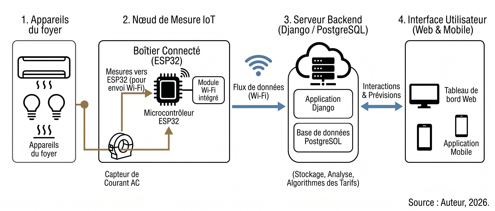

*Source : Auteur, adapté de El-Khozondar et al. (2024) et Ezhilarasi et al. (2023).*

### 2.1.2 Études de cas IoT dans des contextes similaires à la Côte d’Ivoire

La littérature documente plusieurs déploiements IoT dans des contextes proches du contexte ivoirien, validant la faisabilité technique et identifiant des enseignements transposables. Au Bangladesh, Ahammed et Khan (Energy, Vol. 250, Art. 123747, Elsevier, 2022) ont démontré le déploiement d’un compteur intelligent IoT équipé d’un capteur de courant de type transformateur couplé à un microcontrôleur, assurant surveillance locale et en ligne, transmission bidirectionnelle de données et gestion côté consommateur (Ahammed et Khan 2022). Ce choix technologique (un capteur transformateur de courant et un microcontrôleur) est cohérent avec l’association ZMCT103C + ESP32 retenue dans AOCEDA. Le Bangladesh présente des similitudes structurelles avec la Côte d’Ivoire : économie émergente, électrification en cours, contraintes de budget des ménages.

Au Kenya, Lubota et al. (SSRG International Journal of Electrical and Electronics Engineering, Vol. 11, No. 5, 2024) décrivent un système IoT de facturation intelligente identifiant des problèmes identiques à ceux des abonnés ivoiriens : intervention manuelle, erreurs de facturation et absence de sensibilisation aux tarifs (Lubota et al. 2024). En Palestine, El-Khozondar et al. (e-Prime, Elsevier, 2024) ont déployé un système ESP32 lisant les données depuis des compteurs électriques existants dans un contexte d’instabilité électrique chronique, et les transmettant via WhatsApp, canal de communication très largement utilisé en Afrique de l’Ouest (El-Khozondar et al. 2024). Cette approche de mise à niveau progressive des infrastructures existantes est précisément celle préconisée par Ezhilarasi et al. (2023) et adoptée dans le projet AOCEDA.

### 2.1.3 Limites des solutions existantes pour le contexte ivoirien

L’analyse comparée de la littérature révèle quatre limites fondamentales des solutions existantes. Premièrement, le coût prohibitif des solutions commerciales : les compteurs intelligents industriels (Linky en France : 130 €, Smart Meter en Allemagne : 150 à 500 €) sont inaccessibles pour les ménages ivoiriens. Deuxièmement, la dépendance à une infrastructure réseau stable : la plupart des solutions supposent une connectivité Wi-Fi permanente et un réseau électrique fiable, non garantis dans toutes les zones de Côte d’Ivoire (TMC : 26,2 h/an en 2024). Troisièmement, l’absence d’analyse avancée : les systèmes IoT documentés se limitent à la collecte de données brutes, sans détection d’anomalies ni prévision de facturation. Quatrièmement, l’inadaptation locale totale : aucune solution identifiée n’intègre les tarifs CIE en FCFA ni une interface en français.

Ces quatre limites justifient la conception d’une solution spécifique au contexte ivoirien, basée sur l’ESP32 et des capteurs ZMCT103C, non redondante avec les travaux existants.

## 2.2 Intelligence Artificielle appliquée à la consommation énergétique

### 2.2.1 Détection d’anomalies par apprentissage automatique

La détection d’anomalies dans les données de consommation énergétique constitue l’un des axes les plus actifs de l’IA appliquée au bâtiment. La revue de référence du domaine est celle de Himeur et al. (Applied Energy, Vol. 287, Art. 116601, Elsevier, 2021), issue de l’analyse de plus de 200 travaux (Himeur et al. 2021). Ces auteurs établissent que les approches d’apprentissage automatique surpassent systématiquement les méthodes à base de règles fixes pour les anomalies complexes, et identifient cinq problèmes ouverts : absence de définitions standardisées, manque de jeux de données annotés publics, métriques d’évaluation non unifiées, absence de plateformes de reproductibilité, et enjeux de préservation de la vie privée.

Parmi les approches modernes les plus pertinentes Ambat et Sahoo (2024) proposent un cadre hybride combinant LOF (Local Outlier Factor : détection d’anomalies basée sur la densité locale des points), COF (Connectivity-based Outlier Factor : variante tenant compte des connexions entre points voisins) et CBLOF (Cluster-Based Local Outlier Factor : détection par regroupement en nuages de points), suivis de modèles Random Forest, Gradient Boosting et XGBoost, évalués sur trois jeux de données publics de maisons intelligentes (Ambat et Sahoo 2024). Mao et al. (Energies, Vol. 17, No. 19, Art. 4810, MDPI, 2024) proposent pour leur part une approche Autoformer + Random Forest atteignant d’excellentes performances mais nécessitant des volumes importants de données d’entraînement (Mao et al. 2024). Pour ce projet, l’approche à base de règles configurables est retenue, conformément aux recommandations de Himeur et al. (2021) pour les déploiements sans historique : détection opérationnelle dès J + 1, sans données préalables. Dans AOCEDA, les anomalies sont détectées sur les séries temporelles de consommation (kWh par heure) calculées par le backend Django et stockées dans PostgreSQL. Le moteur de détection d’anomalies opère entièrement côté serveur sur ces données ; aucun calcul métier n’est exécuté sur l’ESP32.

### 2.2.2 Désagrégation de charge (NILM) et alternatives

Le Non-Intrusive Load Monitoring (NILM) est une technique qui analyse les variations de courant et de tension en un seul point de mesure pour identifier les appareils en fonctionnement et leur consommation individuelle. Développée par George W. Hart (1985) au MIT dans les années 1980 (Hart 1985), cette technique constitue la solution idéale pour un monitoring granulaire sans multiplier les capteurs. Le nombre de publications sur le NILM a fortement augmenté depuis 2018 grâce aux avancées en deep learning (Liu et al. 2024).

Zhao et al. (Heliyon, Vol. 10, No. 9, Cell Press, 2024) intègrent un réseau Vision Transformer pour identifier des appareils inconnus dans un flux NILM, adressant la limite fondamentale que représente la nécessité de connaître l’inventaire préalable des appareils (Zhao et al. 2024). Shahab et al. (2023) proposent une approche CNN seq2-point combinée à l’edge computing, atteignant une précision de 94,6 % (Shahab et al. 2023). Ces performances remarquables nécessitent cependant des capteurs à haute fréquence d’échantillonnage (plusieurs kHz) et des GPU pour l’entraînement, ressources incompatibles avec un prototype académique L3.

Ce projet ne met pas en œuvre de NILM. L’approche retenue est le monitoring par capteur de courant, déjà présenté en section 2.1.1 (ZMCT103C) : il permet un suivi par appareil sans GPU ni échantillonnage à haute fréquence, contrairement au NILM, et reste recommandé pour les déploiements à ressources limitées (Ezhilarasi et al. 2023). Les modalités concrètes de câblage et de déploiement (surveillance globale ou par circuit) sont détaillées au chapitre 5.

### 2.2.3 Comparaison des approches et choix retenus

Le tableau 2.1 synthétise les trois grandes familles d’approches IA identifiées dans la littérature, selon les critères pertinents pour le contexte ivoirien.

***Tableau 2.1 : Comparaison des approches IA de gestion énergétique selon la faisabilité en contexte ivoirien***

|                      |                      |                        |                   |                     |
|----------------------|----------------------|------------------------|-------------------|---------------------|
| **Critère**          | **Règles configur.** | **ML / Deep Learning** | **NILM**          | **Choix du projet** |
| **Données requises** | Aucune               | Historique \> 30 j     | Dataset annoté    | Oui (Règles)        |
| **Opérationnel J+1** | Oui                  | Non                    | Non               | Oui                 |
| **Précision**        | Acceptable           | Très élevée            | Très élevée       | Acceptable          |
| **Matériel**         | ESP32 + CT           | ESP32 + CT + GPU       | Capteur kHz + GPU | ESP32 + CT          |
| **Coût matériel**    | \< 15 000 FCFA       | Moyen                  | Élevé             | \< 15 000 FCFA      |
| **Adapté MVP L3**    | Oui                  | Partiel                | Non               | Oui                 |

*Source : Auteur, d’après Himeur et al. (2021), Ambat et Sahoo (2024), Mao et al. (2024), Shahab et al. (2023).*

L’analyse du tableau 2.1 confirme que l’approche à base de règles configurables couplée à une projection mathématique pour l’estimation de la facturation (87 FCFA/kWh, Ministère de l’Énergie CI 2024) est la seule combinaison compatible avec les contraintes d’un prototype académique opérationnel dès le premier jour, sans données historiques préalables. Cette approche est confirmée par Himeur et al. (2021).

## 2.3 Agents conversationnels et LLM pour la gestion énergétique

### 2.3.1 Revue de la littérature sur les chatbots énergétiques

L’intégration des agents conversationnels dans les systèmes de gestion énergétique constitue un domaine de recherche émergent. La revue de référence est celle de Sanguinetti et Atzori (Electronics, Vol. 13, No. 2, Art. 401, MDPI, janvier 2024), première synthèse systématique sur les agents conversationnels appliqués à la sensibilisation et à l’efficacité énergétique (Sanguinetti et Atzori 2024). Les auteurs concluent que les chatbots « représentent un canal précieux pour recevoir des informations détaillées sur la consommation d’énergie et des conseils personnalisés » (notre traduction) et documentent l’intégration de ChatGPT dans le système Cooee (assistant énergétique conversationnel) pour améliorer la résolution d’ambiguïtés linguistiques.

Matharaarachchi et al. (Energies, Vol. 17, No. 8, Art. 1935, MDPI, avril 2024) présentent un framework de chatbot génératif basé sur un LLM (API compatible), optimisé pour interroger des flux de données IoT énergétiques via conversion langage naturel → SQL (Matharaarachchi et al. 2024). Les auteurs démontrent que les LLM permettent d’interroger efficacement des flux de données IoT énergétiques, en générant automatiquement des requêtes SQL à partir du langage naturel, et concluent que cette approche est particulièrement adaptée aux opérateurs de réseaux électriques. Ce travail valide directement l’approche GPT + IoT adoptée dans ce projet. EnergyGPT (Chebbi et Kolade 2025), développé par fine-tuning de LLaMA 3.1-8B, illustre quant à lui la trajectoire future des LLM spécialisés en énergie, mais son coût de développement dépasse largement le cadre d’un projet académique L3.

### 2.3.2 Architecture LLM-agnostique et choix de Grok (xAI) comme assistant conversationnel

Un principe fondamental de l’architecture développée dans ce projet est sa conception LLM-agnostique : le système est conçu de telle sorte que toute personne disposant d’une clé API d’un modèle de langage, qu’il s’agisse de Grok (xAI), GPT-4o (OpenAI), Mistral, Claude (Anthropic) ou tout autre LLM proposant une API standard, peut l’intégrer en renseignant simplement cette clé dans la configuration du système, sans modifier une seule ligne de code. Ce choix de conception garantit la pérennité et l’adaptabilité de la plateforme face aux évolutions rapides du marché des LLM. Dans le cadre de ce projet académique, le modèle retenu est Grok, développé par xAI. Ce choix repose sur quatre critères décisifs. Premièrement, l’accès immédiat sans entraînement ni GPU : Grok est accessible via une API standard compatible avec les bibliothèques Python courantes et est opérationnel dès la première requête, sans aucune phase d’apprentissage préalable (Matharaarachchi et al. 2024 ; Sanguinetti et Atzori 2024). Deuxièmement, l’adaptation au contexte ivoirien via prompt engineering : les tarifs CIE (87 FCFA/kWh), la langue française et les habitudes de consommation locales sont injectés dans le prompt système, orientant les réponses de Grok vers le contexte précis de l’utilisateur ivoirien ; Troisièmement, la fiabilité et la performance de Grok pour la génération de texte en français : Grok présente de bonnes capacités de compréhension et de génération en français, ce qui est essentiel pour délivrer des conseils énergétiques clairs et accessibles aux ménages ivoiriens francophones (xAI 2024). Quatrièmement, la conformité au principe privacy-by-design : seules les données numériques de consommation (kWh, FCFA, seuils d’alerte) sont transmises à l’API Grok ; aucune information personnellement identifiable (nom, adresse, numéro d’abonné CIE) ne quitte le serveur local, conformément aux exigences identifiées par Himeur et al. (2021).

La figure 2.2 illustre l’architecture fonctionnelle de l’assistant IA conversationnel intégré dans la plateforme.

***Figure 2.2 : Architecture fonctionnelle de l’assistant IA conversationnel***

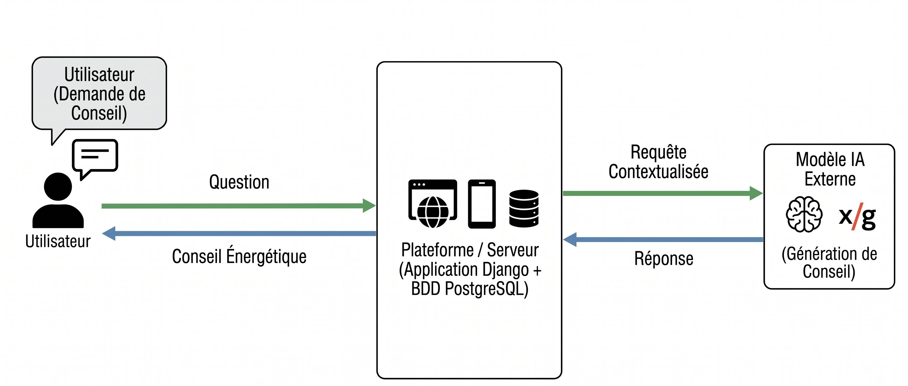

*Source : Auteur, adapté de Matharaarachchi et al. (2024) et Sanguinetti et Atzori (2024).*

### 2.3.3 Positionnement du projet et synthèse critique

Le tableau 2.2 compare les principales approches LLM pour la gestion énergétique identifiées dans la littérature avec l’approche adoptée dans ce projet, selon les critères les plus pertinents pour un déploiement en Afrique de l’Ouest francophone.

***Tableau 2.2 : Comparaison des approches LLM pour la gestion énergétique***

|                           |                                        |                                               |                             |                            |
|---------------------------|----------------------------------------|-----------------------------------------------|-----------------------------|----------------------------|
| **Critère**               | **Cooee + ChatGPT (Sanguinetti 2024)** | **Chatbot GPT (Matharaarachchi et al. 2024)** | **EnergyGPT (LLaMA, 2025)** | **Ce projet (Grok / xAI)** |
| **Langue interface**      | Anglais                                | Anglais                                       | Anglais                     | Français                   |
| **Monnaie locale**        | Euro / n.s.                            | Non spécifié                                  | Non spécifié                | FCFA                       |
| **Intégration IoT**       | Partielle                              | Oui (SQL)                                     | Non                         | Oui (API REST)             |
| **GPU requis**            | Non                                    | Non                                           | Oui                         | Non                        |
| **Contexte Afrique/FCFA** | Non                                    | Non                                           | Non                         | Oui                        |
| **Privacy-by-design**     | Non précisé                            | Partiel                                       | Oui (local)                 | Oui (sans PII)             |

*Source : Auteur, d’après Sanguinetti et Atzori (2024), Matharaarachchi et al. (2024), Chebbi et Kolade (2025) et xAI (2024).*

Le tableau 2.2 établit que la combinaison d’une architecture LLM-agnostique (permettant l’utilisation de n’importe quel LLM via clé API configurable), couplée au contexte IoT et à une interface en français avec tarifs en FCFA, constitue une contribution originale non couverte par les travaux existants. Dans ce projet, Grok (xAI) est le modèle configuré.

L’examen croisé des trois sections de ce chapitre permet d’établir le tableau synthétique 2.3, qui positionne ce projet au regard de l’ensemble des familles de solutions existantes selon cinq critères clés.

***Tableau 2.3 : Positionnement du projet par rapport aux solutions existantes***

|                            |                           |                                  |                        |                      |               |
|----------------------------|---------------------------|----------------------------------|------------------------|----------------------|---------------|
| **Critère**                | **Compteurs commerciaux** | **IoT académiques (BD, KE, PS)** | **IA détection anom.** | **LLM énergétiques** | **Ce projet** |
| **Low-cost FCFA**          | Non                       | Oui                              | Non                    | Partiel              | Oui           |
| **Opérationnel J+1**       | Oui                       | Oui                              | Non                    | Oui                  | Oui           |
| **Tarif CIE/FCFA**         | Non                       | Non                              | Non                    | Non                  | Oui           |
| **Assistant IA français**  | Non                       | Non                              | Non                    | Anglais uniquement   | Oui           |
| **Sans GPU / open-source** | Non                       | Oui                              | Non                    | Non                  | Oui           |

*Source : Auteur, d’après l’ensemble des travaux analysés dans ce chapitre.*

L’analyse du tableau 2.3 établit un constat sans équivoque : aucune solution existante ne combine simultanément les cinq propriétés nécessaires au déploiement en contexte ivoirien. Ce gap constitue la justification académique centrale de ce mémoire. La contribution originale est donc la conception d’une plateforme unifiée combinant un dispositif IoT à bas coût (ESP32 + capteurs ZMCT103C), un backend Django REST + PostgreSQL avec détection d’anomalies par règles et projection de facturation en FCFA, et un assistant conversationnel basé sur Grok (xAI), dans une architecture LLM-agnostique, entièrement adapté au contexte ivoirien et opérationnel dès J + 1.

Les chapitres suivants, constituant la Partie II, présenteront l’analyse des besoins et les spécifications fonctionnelles (Chapitre 3), puis l’architecture globale et la conception détaillée du système (Chapitre 4).

**DEUXIÈME PARTIE**

**CONCEPTION ET ARCHITECTURE DU SYSTÈME**

# CHAPITRE 3 - ANALYSE DES BESOINS ET SPÉCIFICATIONS

Ce chapitre présente l’analyse complète des besoins du système AOCEDA. Il identifie d’abord les acteurs et leurs interactions via le diagramme de cas d’utilisation (section 3.1), formule les spécifications fonctionnelles selon la méthode MoSCoW (section 3.2), et définit les contraintes non fonctionnelles et l’analyse des risques (section 3.3).

## 3.1 Identification des acteurs et cas d’utilisation

### 3.1.1 Identification des acteurs du système

L’analyse du cahier des charges (CDC-AOCEDA-2025-v1.0) a permis d’identifier cinq acteurs. Le « Visiteur » est l’utilisateur non authentifié pouvant accéder à la page de connexion et demander une réinitialisation de mot de passe. Le « Client (Utilisateur) » est l’acteur principal : le ménage abonné qui utilise toutes les fonctionnalités de monitoring, d’alerte et de conseil IA. L’« Administrateur » gère les comptes utilisateurs, surveille les capteurs et configure le système. Le « Technicien » installe les dispositifs IoT et crée le compte du client associé (enregistrement ESP32, génération de la clé API, diagnostic, déclaration de pannes, interventions). L’« ESP32 (Dispositif IoT) » est un acteur système : il s’authentifie via API Key, envoie les mesures, synchronise ses données différées et vérifie sa connexion. L’API Grok (xAI) est un système externe modélisé dans les diagrammes de séquence du chapitre 4.

### 3.1.2 Diagramme de cas d’utilisation

La figure 3.1 présente l’ensemble des interactions entre les cinq acteurs et le système AOCEDA. Le diagramme est organisé autour du système central « Application AOCEDA - Suivi Consommation Électrique », avec une légende distinguant les relations « extend » (optionnel/conditionnel) et « include » (obligatoire/toujours appelé), conformément à la notation UML standard.

***Figure 3.1 : Diagramme de cas d’utilisation de l’application AOCEDA***

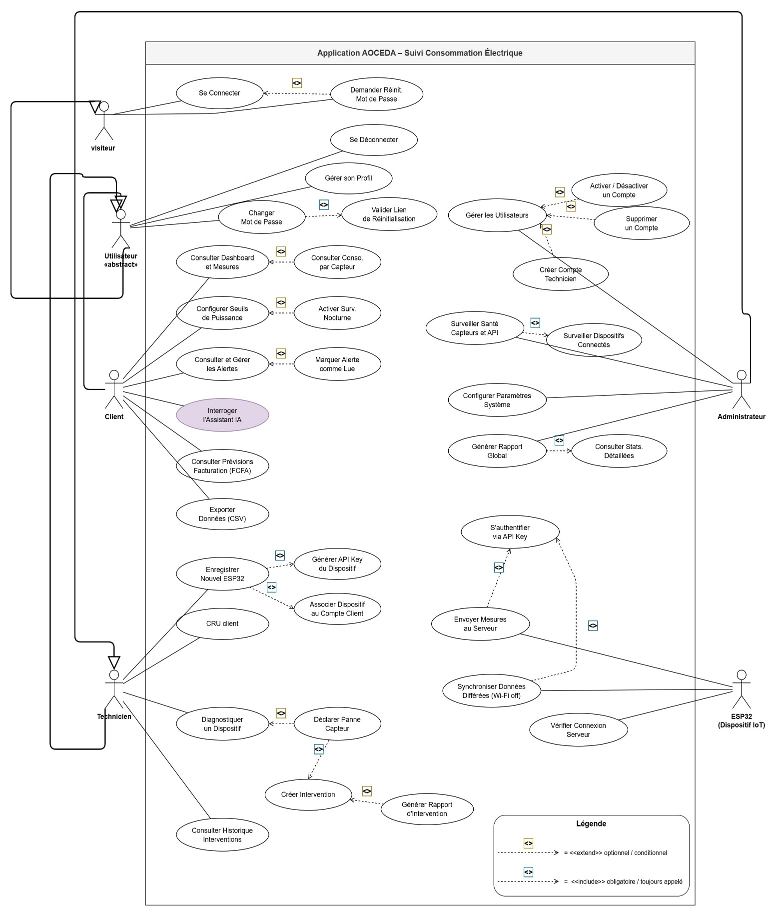

*Source : Auteur (2026), réalisé avec draw.io, conforme au CDC-AOCEDA-2025-v1.0.*

Autour de la frontière du système, le diagramme fait apparaître le Client comme l’acteur central : il concentre l’essentiel des cas d’utilisation, que l’on peut regrouper en quatre familles, le suivi de la consommation (tableau de bord, historique, détail par appareil), la gestion des alertes, le conseil énergétique via l’assistant IA et la prévision de facturation. Les autres acteurs interviennent sur des périmètres plus ciblés, déjà décrits en 3.1.1. Deux types de liens structurent le diagramme : les relations include représentent les comportements obligatoires partagés, comme l’authentification systématiquement requise avant toute action, tandis que les relations extend représentent les comportements optionnels, activés seulement sous certaines conditions. Cette distinction permet de lire directement quelles fonctionnalités sont accessibles à chaque acteur et lesquelles ne s’exécutent que dans des cas particuliers.

### 3.1.3 Description détaillée des cas d’utilisation principaux

Le tableau 3.1 détaille, selon le format UML standard, les trois cas d’utilisation les plus représentatifs du système : la consultation du tableau de bord (cœur du monitoring), l’interrogation de l’assistant IA (valeur ajoutée du projet) et la configuration des seuils d’alerte (personnalisation par le ménage).

***Tableau 3.1 : Description détaillée des cas d’utilisation principaux***

|                        |                                                      |                                                                        |                                                       |
|------------------------|------------------------------------------------------|------------------------------------------------------------------------|-------------------------------------------------------|
| **Champ**              | **Consulter Dashboard**                              | **Interroger l’Assistant IA**                                          | **Configurer seuils**                                 |
| **Acteur**             | Ménage (Abonné)                                      | Ménage (Abonné)                                                        | Ménage                                                |
| **Précondition**       | Utilisateur connecté, capteur actif                  | Connecté, quota API disponible                                         | Utilisateur connecté                                  |
| **Scénario principal** | Accès dashboard → graphiques temps réel → historique | Saisie question → contexte IoT injecté → API Grok (xAI) → réponse FCFA | Sélection capteur → définition seuil → enregistrement |
| **Alt. / Exception**   | Capteur hors ligne → dernière valeur connue + alerte | Quota épuisé → mode dégradé (règles uniquement)                        | Valeur hors plage → erreur de validation              |

*Source : Auteur (2026), d’après le CDC-AOCEDA-2025-v1.0.*

### 3.1.4 Diagrammes d’activité des processus métier

Les diagrammes d’activité décrivent étape par étape comment se déroulent les processus métier les plus importants du système AOCEDA. Ils complètent le diagramme de cas d’utilisation présenté à la section 3.1.2 en montrant non seulement « qui fait quoi », mais aussi « dans quel ordre et sous quelles conditions ». Trois processus clés ont été modélisés et sont présentés ci-après.

Le premier processus modélisé est l’authentification des utilisateurs. Ce diagramme couvre deux cas : la première connexion avec identifiants temporaires (CAS 1) et la reconnexion normale avec gestion des tentatives échouées, blocage de compte et réinitialisation par email (CAS 2). Ce processus est détaillé dans la figure 3.2 ci-dessous.

***Figure 3.2 : Diagramme d’activité, Processus d’authentification AOCEDA***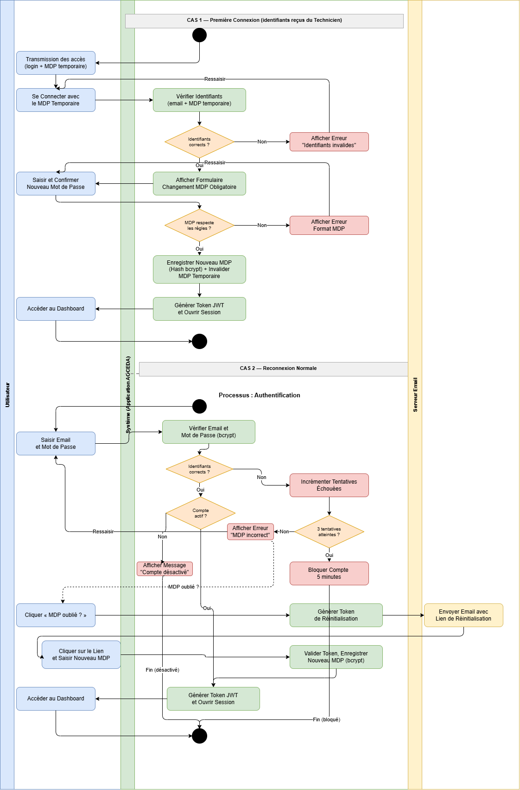

*Source : Auteur (2026), réalisé avec draw.io, conforme au CDC-AOCEDA-2025-v1.0.*

Ce diagramme montre la sécurisation de l’accès : changement de mot de passe obligatoire à la première connexion, et blocage après trois tentatives échouées. La réinitialisation par email est entièrement automatisée et sécurisée par token à usage unique. À l’issue d’une connexion réussie, le système génère un token JWT qui authentifie ensuite chaque requête de l’utilisateur. Le deuxième processus est l’envoi des mesures IoT et le déclenchement des alertes. Ce diagramme implique trois acteurs : l’ESP32 (terrain), le système Django (serveur) et le Client (destinataire des notifications). La figure 3.3 ci-dessous en illustre le déroulement.

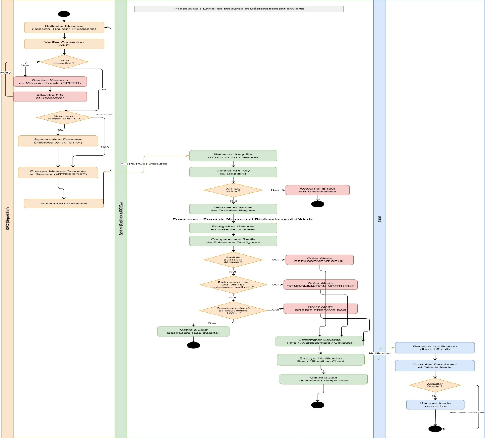***Figure 3.3 : Diagramme d’activité, Envoi de mesures et déclenchement d’alerte***

*Source : Auteur (2026), réalisé avec draw.io, conforme au CDC-AOCEDA-2025-v1.0.*

Ce diagramme illustre la double contrainte du contexte ivoirien : le système fonctionne sans Wi-Fi grâce au tampon SPIFFS et détecte immédiatement les anomalies via trois types d’alertes configurées par l’utilisateur (dépassement de seuil, consommation nocturne, crédit prépayé bas). Cette détection immédiate est complétée par une tâche Celery périodique (toutes les deux minutes), filet de sécurité pour les mesures synchronisées en différé. La figure 3.4 ci-dessous présente le troisième processus, la consultation du tableau de bord et le calcul des prévisions, impliquant le Client et le système Django.

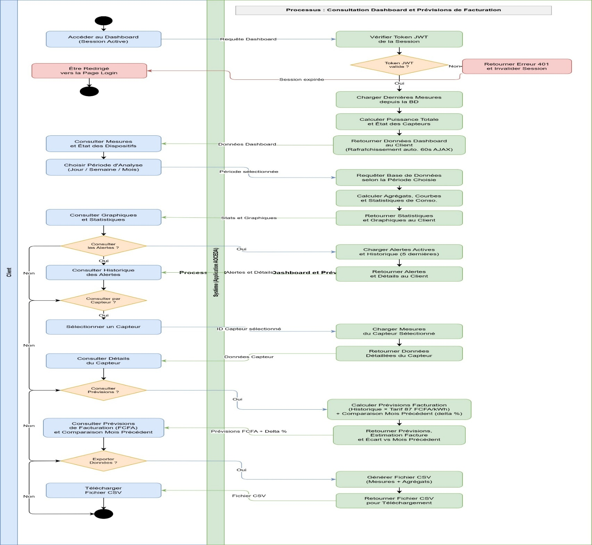***Figure 3.4 : Diagramme d’activité, Consultation dashboard et prévisions de facturation AOCEDA***

*Source : Auteur (2026), réalisé avec draw.io, conforme au CDC-AOCEDA-2025-v1.0.*

Ce diagramme montre comment le système assure un accès sécurisé au tableau de bord (vérification JWT) tout en offrant une visualisation riche et interactive : graphiques Chart.js, filtrage par période, détail par capteur et prévisions de facturation adaptées au tarif CIE. La possibilité d’exporter les données en CSV permet au ménage de conserver un historique de sa consommation.

## 3.2 Spécifications fonctionnelles (méthode MoSCoW)

### 3.2.1 Présentation de la méthode

La méthode MoSCoW (Must have, Should have, Could have, Won’t have) est une technique de priorisation des exigences largement utilisée dans les projets agiles (Clegg et Barker 1994). Pour le projet AOCEDA, elle permet de définir un périmètre réaliste en seize semaines avec un développeur unique, en distinguant les fonctionnalités indispensables au MVP de celles reportables à des versions ultérieures.

### 3.2.2 Tableau des spécifications MoSCoW

Le tableau ci-dessous répartit les exigences fonctionnelles selon leur priorité et associe chacune au module Django correspondant. Les fonctionnalités classées Must Have constituent le périmètre du produit minimum viable (MVP).

***Tableau 3.2 : Spécifications fonctionnelles selon la méthode MoSCoW***

|                 |                                                               |                   |
|-----------------|---------------------------------------------------------------|-------------------|
| **Priorité**    | **Fonctionnalité**                                            | **Module Django** |
| **MUST HAVE**   | Authentification (connexion, déconnexion, profil)             | accounts          |
| **MUST HAVE**   | Acquisition temps réel ESP32 (ZMCT103C)                       | sensors           |
| **MUST HAVE**   | Stockage mesures en base PostgreSQL                           | sensors           |
| **MUST HAVE**   | Tableau de bord avec graphiques (kWh, W, FCFA)                | dashboard         |
| **MUST HAVE**   | Détection d’anomalies par règles configurables                | alerts            |
| **MUST HAVE**   | Prévision de facturation en FCFA (87 FCFA/kWh CIE)            | analytics         |
| **MUST HAVE**   | API REST pour communication ESP32 → serveur                   | sensors (DRF)     |
| **SHOULD HAVE** | Assistant IA conversationnel (Grok/xAI, FCFA, français)       | ai_assistant      |
| **SHOULD HAVE** | Alertes en temps réel (WebSocket)                             | alerts            |
| **SHOULD HAVE** | Historique par période (jour, semaine, mois)                  | analytics         |
| **SHOULD HAVE** | Export des données en format CSV                              | analytics         |
| **SHOULD HAVE** | Application mobile (Flutter)                                  | \-                |
| **COULD HAVE**  | Tableau de bord administrateur avec statistiques globales     | dashboard         |
| **WON’T HAVE**  | Intégration directe avec système CIE / ANARE-CI               | Non applicable    |
| **WON’T HAVE**  | NILM (capteur unique haute fréquence) ou ML avec entraînement | Non applicable    |

*Source : Auteur (2026), d’après le CDC-AOCEDA-2025-v1.0.*

### 3.2.3 Indicateurs de performance (KPI)

Quatre KPI permettront de valider le système lors des tests (Chapitre 7). Le KPI 1 (précision de mesure) impose un écart inférieur à 5 % avec la valeur de référence (wattmètre certifié). Le KPI 2 (latence de traitement) exige qu’une mesure reçue par l’API soit traitée et disponible sur le tableau de bord en moins de 5 secondes côté serveur, l’affichage suivant le cycle de rafraîchissement de 60 secondes. Le KPI 3 (pertinence IA) vise au moins 80 % de réponses jugées pertinentes par un panel de cinq utilisateurs. Le KPI 4 (Opérationnalisation) impose un système fonctionnel dans les 12 minutes suivant l’installation IoT.

## 3.3 Contraintes non fonctionnelles et analyse des risques

### 3.3.1 Contraintes non fonctionnelles

Le tableau ci-dessous récapitule les contraintes non fonctionnelles du système, chacune étant justifiée par une réalité du contexte ivoirien.

***Tableau 3.3 : Contraintes non fonctionnelles du système AOCEDA***

|                   |                                                             |                                           |
|-------------------|-------------------------------------------------------------|-------------------------------------------|
| **Dimension**     | **Exigence**                                                | **Justification**                         |
| **Performance**   | Temps de réponse API REST \< 200 ms, dashboard \< 3 s       | Connexion internet variable en CI         |
| **Disponibilité** | Disponibilité serveur ≥ 95 % (hors coupures réseau)         | TMC de 26,2 h/an en CI (CI-ENERGIES 2023) |
| **Sécurité**      | HTTPS, JWT, bcrypt (coût 12), privacy-by-design             | Données énergétiques sensibles            |
| **Utilisabilité** | Interface en français, responsive, sans formation requise   | Public peu technicisé en CI               |
| **Coût**          | Matériel IoT \< 15 000 FCFA, hébergement \< 5 000 FCFA/mois | Contrainte budgétaire ménages ivoiriens   |

*Source : Auteur (2026), d’après le CDC-AOCEDA-2025-v1.0.*

### 3.3.2 Analyse des risques

Le tableau ci-dessous identifie les principaux risques du projet, évalue leur probabilité et leur impact, et associe à chacun une stratégie d’atténuation concrète.

***Tableau 3.4 : Analyse des risques du projet AOCEDA***

|                                                          |                 |            |                                                         |
|----------------------------------------------------------|-----------------|------------|---------------------------------------------------------|
| **Risque identifié**                                     | **Probabilité** | **Impact** | **Stratégie d’atténuation**                             |
| Instabilité réseau électrique (coupures CIE)             | Haute           | Moyen      | Stockage tampon local ESP32 + synchro. différée         |
| Indisponibilité de l’API LLM (Grok/xAI) ou coût excessif | Faible          | Élevé      | Quota 10 req./jour + mode dégradé (règles uniquement)   |
| Imprécision des capteurs ZMCT103C                        | Moyenne         | Moyen      | Calibration systématique + correction logicielle        |
| Connectivité Wi-Fi insuffisante dans le foyer            | Moyenne         | Moyen      | Support MQTT en alternative à HTTP                      |
| Dépassement du délai de 16 semaines                      | Moyenne         | Élevé      | Périmètre Must Have prioritaire, Could Have reporté     |
| Violation confidentialité des données                    | Faible          | Critique   | Anonymisation + aucune PII vers API + HTTPS obligatoire |

*Source : Auteur (2026), d’après le CDC-AOCEDA-2025-v1.0.*

L’analyse des besoins étant complète, le chapitre suivant présente l’architecture globale retenue pour le système et la conception détaillée de chacune de ses composantes.

#  CHAPITRE 4 - ARCHITECTURE GLOBALE ET CONCEPTION DÉTAILLÉE

Ce chapitre présente l’architecture technique du système AOCEDA. Il détaille l’architecture en couches (section 4.1), le modèle de données et le schéma de la base de données (section 4.2), les protocoles de sécurité implémentés (section 4.3) et les diagrammes de séquence des flux du système (section 4.4). La section 4.5 propose enfin une synthèse de l’architecture retenue.

## 4.1 Architecture en couches du système

### 4.1.1 Justification du pattern architectural

L’architecture retenue est un « monolithe modulaire » basé sur Django. Ce choix repose sur trois arguments. Premièrement, la simplicité de déploiement : un seul serveur, une seule base de données, une seule configuration ; complexité opérationnelle minimale pour un développeur unique. Deuxièmement, la modularité préservée : Django structure le code en applications indépendantes qui découplent les responsabilités sans la surcharge d’une architecture microservices. Troisièmement, l’évolutivité : le monolithe peut être découpé en services si la scalabilité l’exige à terme.

### 4.1.2 Description des quatre couches

Le système AOCEDA s’organise en quatre couches fonctionnelles. La couche de présentation (Couche 1) comprend le tableau de bord web rendu par Django Templates avec Chart.js pour les graphiques, accessible depuis tout appareil grâce à une conception responsive. La couche applicative (Couche 2) est le backend Django avec six applications métier : « accounts » (authentification JWT), « sensors » (réception mesures IoT), « analytics » (calculs et prévisions FCFA), « alerts » (détection anomalies), « dashboard » (vues HTML) et « ai_assistant » (interface LLM Grok, configurable). La couche de données (Couche 3) est gérée par PostgreSQL via l’ORM Django. La couche IoT (Couche 4) comprend les ESP32 avec capteurs qui transmettent les mesures via HTTPS POST vers l’API REST Django REST Framework.

### 4.1.3 Structure des applications Django

Le Tableau 4.1 récapitule ces six applications en précisant, pour chacune, ses modèles de données principaux, ses responsabilités fonctionnelles et les endpoints de l’API REST qu’elle expose.

***Tableau 4.1 : Structure des six applications Django du système AOCEDA***

|                  |                                     |                                               |                                   |
|------------------|-------------------------------------|-----------------------------------------------|-----------------------------------|
| **Application**  | **Modèles principaux**              | **Responsabilités**                           | **Endpoints API**                 |
| **accounts**     | Utilisateur, Client, Administrateur | Authentification, gestion profils, tokens JWT | /api/auth/, /api/users/           |
| **sensors**      | Capteur, Mesure, Dispositif         | Réception mesures ESP32, stockage BDD         | /api/sensors/, /api/mesures/      |
| **analytics**    | Prévision                           | Calculs statistiques, prévisions FCFA         | /api/analytics/, /api/previsions/ |
| **alerts**       | Alerte, Seuil                       | Moteur anomalies par règles, notifications    | /api/alertes/, /api/regles/       |
| **dashboard**    |                                     | Vues HTML, contexte graphiques Chart.js       | /, /tableau-de-bord/              |
| **ai_assistant** | SessionChatIA                       | Injection contexte IoT, appel API Grok (xAI)  | /api/assistant/                   |

*Source : Auteur (2026), d’après le CDC-AOCEDA-2025-v1.0.*

Ce découpage garantit une forte cohésion interne et un faible couplage : chaque application encapsule un domaine métier unique, ce qui facilite sa maintenance et son évolution de manière indépendante.

## 4.2 Modèle de données et schéma de la base de données

### 4.2.1 Diagramme de classes

Le diagramme de classes modélise l’ensemble des entités du système AOCEDA, leurs attributs, méthodes et relations. Chaque classe correspond à une table de la base de données PostgreSQL, générée automatiquement par l’ORM Django. Le diagramme compte quatorze classes réparties en trois catégories : les classes utilisateurs (Utilisateur, Visiteur, Client, Technicien, Administrateur), les classes IoT (Dispositif, Capteur, Seuil, Mesure) et les classes fonctionnelles (Alerte, Prévision, SessionChatIA, Intervention, RapportIntervention). La figure 4.1 ci-dessous présente ce diagramme.

***Figure 4.1 : Diagramme de classes de l’application AOCEDA***

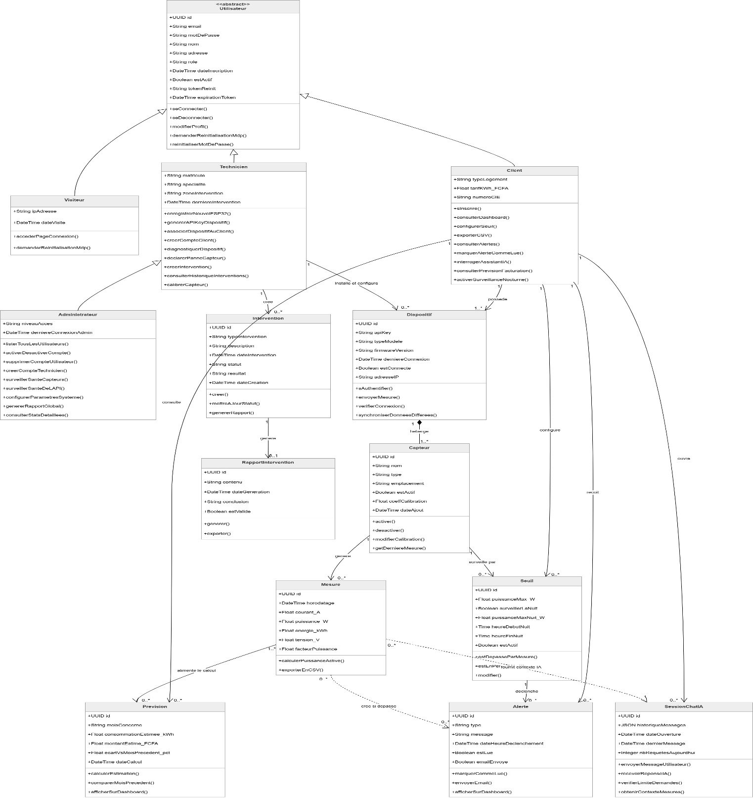

*Source : Auteur (2026), réalisé avec draw.io, conforme au CDC-AOCEDA-2025-v1.0.*

Dans le détail, la classe abstraite « Utilisateur » est la classe mère commune (UUID id, email, motDePasse, nom, adresse, rôle, dateInscription, estActif, tokenReset, dateExpirationToken ; méthodes seConnecter, seDéconnecter, modifierProfil, demanderRéinitialisationMdp, réinitialiserMotDePasse). Elle est spécialisée en quatre sous-classes par héritage : « Visiteur » (accès page publique), « Client » (typeLogement, tarifkWh_FCFA, numéroCIE ; méthodes consulterDashboard, configurerSeuil, interrogerAssistantIA, consulterPrévisionFacturation, exporterCSV, activerSurveillanceNocturne), « Technicien » (matricule, spécialité, dateIntervention ; méthodes enregistrerNouvelESP32, générerAPIKey, associerDispositifAuClient, calibrerCapteur, déclarerPanneCapteur, créerIntervention) et « Administrateur » (niveauAcces ; méthodes gérer les comptes, surveiller les capteurs et l’API, configurer le système, générer des rapports). Le « Technicien » installe et configure un « Dispositif » (UUID, apiKeyDevice, firmwareVersion, estConnecté, adresseIP ; méthodes s’authentifier, envoyerMesure, synchroniserDonnéesDifférées). Un « Dispositif » héberge des « Capteur » (nom, type, estActif, coeffCalibration ; méthodes activer, modifierCalibration, getDernièreMesure). Chaque capteur est configuré par un « Seuil » (puissanceMax_W, surveilleNuit, heureDébutNuit, heureFinNuit) et génère des « Mesure » (horodatage, courant_A, puissance_W, énergie_kWh, tension_V, facteurPuissance ; méthodes calculerPuissance, exporterEnCSV). Une mesure peut déclencher une « Alerte » (type, message, dateDéclenchement, estLue, emailEnvoyé, sévérité) et générer une « Prévision » (moisConcerné, consomméeEstimée_kWh, montantEstimé_FCFA, écartSurMoisPrécédent ; méthodes calculerEstimation, comparerMoisPrécédent, afficherSurDashboard). Le « Client » est associé à une ou plusieurs « SessionChatIA » (JSON historiqueMessages, dateOuverture, dernièreMessage, nbRequetesAujourdHui ; méthodes envoyerMessage, obtenirContexteMesures). Le « Technicien » crée des « Intervention » (typeIntervention, description, dateIntervention, statut, résultat) qui génèrent des « RapportIntervention » (contenu, dateGénération, conclusion, estValidé ; méthodes générer, reporter).

### 4.2.2 Schéma de la base de données

***Tableau 4.2 : Tables principales de la base de données PostgreSQL***

|                      |                  |                      |                                                                                                            |
|----------------------|------------------|----------------------|------------------------------------------------------------------------------------------------------------|
| **Table**            | **Clé primaire** | **Clés étrangères**  | **Champs principaux**                                                                                      |
| accounts_utilisateur | UUID id          |                      | email, password_hash, nom, role, estActif, token_reset, date_expiration_token                              |
| accounts_client      | (hérite id)      | utilisateur_ptr_id   | typeLogement, tarifkWh_FCFA, adresse                                                                       |
| sensors_capteur      | UUID id          | client_id            | type, valeurMax, actif, derniereLecture                                                                    |
| sensors_mesure       | UUID id          | capteur_id           | puissance (W), courant (A), energie (kWh), tension_V (numérique), facteur_puissance (numérique), timestamp |
| alerts_alerte        | UUID id          | mesure_id, client_id | type, message, lue, createdAt                                                                              |
| ai_sessionchatia     | UUID id          | client_id            | historique_messages (JSON), nb_requetes_aujourd_hui (INT), timestamp (DATETIME)                            |
| sensors_dispositif   | UUID id          | client_id            | apiKeyDevice, firmwareVersion, estConnecté, adresseIP                                                      |
| alerts_seuil         | UUID id          | client_id,capteur_id | puissanceMax_W, surveilleNuit, heureDébutNuit, heureFinNuit                                                |
| analytics_prevision  | UUID id          | client_id            | moisConcerné, consomméeEstimée_kWh, montantEstimé_FCFA, écartSurMoisPrécédent                              |

*Source : Auteur (2026), d’après le CDC-AOCEDA-2025-v1.0.*

L’organisation de ces neuf tables principales sous PostgreSQL garantit la persistance et l’intégrité des flux télémétriques et des historiques de l’assistant IA. Les relations entre ces tables reposent sur des clés étrangères qui traduisent les associations du diagramme de classes : chaque mesure est rattachée à son capteur d’origine, chaque capteur à son dispositif, et les alertes comme les prévisions dérivent des mesures collectées, ce qui garantit l’intégrité référentielle de l’ensemble des données. La manipulation et l’accès à ces données de consommation hautement sensibles nécessitent la mise en œuvre de protocoles de sécurité rigoureux, qui font l’objet de la section suivante.

## 4.3 Protocoles de sécurité

### 4.3.1 Authentification et autorisation

Le système implémente une stratégie de sécurité en profondeur (defense-in-depth) en quatre niveaux. Au premier niveau, l’authentification utilise des jetons JWT (gérés par djangorestframework-simplejwt) avec une durée de vie de 30 minutes pour le jeton d’accès et 7 jours pour le jeton de rafraîchissement. Les mots de passe sont hachés avec bcrypt (facteur de coût 12), conformément aux recommandations OWASP en matière de hachage de mots de passe (OWASP Foundation 2024). Au deuxième niveau, l’autorisation utilise le système de permissions Django : un Ménage n’accède qu’à ses propres données, les endpoints administrateur sont protégés par IsAdminUser. Au troisième niveau, toutes les communications sont chiffrées en HTTPS (TLS 1.3), et l’ESP32 s’authentifie via un jeton de dispositif unique transmis dans l’en-tête HTTP Authorization. Au quatrième niveau, le principe privacy-by-design garantit qu’aucune donnée personnelle identifiable (PII) n’est transmise à l’API LLM configurée (Grok par défaut).

### 4.3.2 Sécurité de l’API REST et résilience

L’API REST implémente un rate limiting de 100 requêtes par minute pour les endpoints de mesure ESP32 et de 10 requêtes par jour par utilisateur pour l’assistant IA. La validation des entrées est assurée par les serializers DRF. La protection CSRF est activée pour toutes les vues Django, et les en-têtes de sécurité HTTP (HSTS, X-Content-Type-Options) sont configurés.

Pour la résilience, deux mécanismes sont implémentés. Premièrement, le stockage tampon local sur l’ESP32 : en cas de coupure réseau (fréquente en CI, TMC : 26,2 h/an), l’ESP32 conserve jusqu’à 1 000 mesures en mémoire SPIFFS et les retransmet en lot à la reconnexion. Deuxièmement, la dégradation gracieuse de l’interface : si l’API LLM configurée (Grok/xAI) est indisponible, l’assistant bascule vers le mode règles uniquement, garantissant que le tableau de bord et les alertes restent opérationnels.

## 4.4 Diagrammes de séquence des flux système

Le diagramme de séquence représente l’outil de conception le plus détaillé et le plus critique de ce chapitre. Contrairement aux modèles statiques, il modélise l’aspect dynamique du système en décrivant chronologiquement, message par message, les interactions croisées entre les composants matériels, logiciels et les API externes. Dans le cadre de la plateforme AOCEDA, ce formalisme permet de valider la robustesse des processus asynchrones, la gestion des sessions sécurisées et la résilience face aux pannes de connectivité réseau.

Afin de couvrir l’intégralité du cycle de vie du système et de maintenir une lisibilité optimale, l’ingénierie des flux a été segmentée en dix-sept scénarios fonctionnels distincts, répartis en deux grandes parties chronologiques :

- La Partie 1 (scénarios 1 à 9) est centrée sur le cycle utilisateur standard et les flux d’acquisition télémétriques de base (authentification, monitoring temps réel et interaction IA).

- La Partie 2 (scénarios 10 à 17) détaille les flux d’administration, les processus de maintenance matérielle et les tâches de fond automatisées par le serveur.

La figure 4.2 positionnée ci-après formalise la première section des flux, mettant en scène les interactions initiales entre le Client, le Navigateur web, le microcontrôleur ESP32, le backend Django REST Framework, la base de données PostgreSQL et l’API de traitement cognitif Grok (xAI).

***Figure 4.2 : Diagramme de séquence AOCEDA, Partie 1/2 : scénarios 1-9***

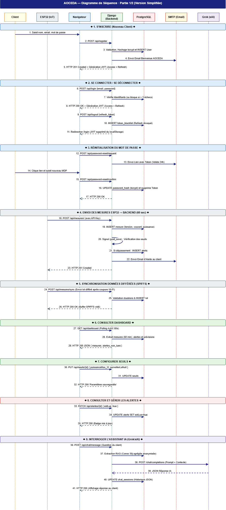

*Source : Auteur (2026).*

Cette première partie de la modélisation dynamique met en exergue la robustesse des protocoles d’accès et d’échange de données. L’implémentation des jetons étatiques JWT assure qu’aucune requête utilisateur n’interroge le backend sans une autorisation préalable valide, réduisant ainsi la surface d’attaque sur les endpoints sensibles du tableau de bord. Au niveau de la couche IoT, le scénario S.4 démontre l’autonomie du boîtier d’acquisition : l’ESP32 structure les mesures brutes du capteur ZMCT103C sous forme de payloads JSON standardisés avant de les expédier par requêtes HTTP POST chiffrées. Le scénario S.5 (synchronisation différée) valide quant à lui la tolérance aux pannes du système : en cas de déconnexion Wi-Fi, l’activation du tampon mémoire SPIFFS empêche la perte des données de consommation, préservant la continuité de l’historique résidentiel. Enfin, le scénario S.9 expose le mécanisme de confidentialité appliqué à l’assistant IA : le serveur isole les mesures numériques brutes, les purge de toute donnée personnellement identifiable (PII), puis transmet ce contexte anonymisé à l’API externe de Grok pour générer des recommandations énergétiques contextualisées en FCFA.

Pour compléter cette vision dynamique, il est indispensable de modéliser les opérations de gestion de second plan, la maintenance des capteurs sur le terrain et la cinétique des processus automatisés par le serveur. La figure 4.3 ci-dessous détaille la seconde partie du diagramme de séquence, matérialisant les scénarios 10 à 17 qui régissent l’administration globale, le cycle de vie des interventions techniques et l’exécution asynchrone des tâches de fond.

***Figure 4.3 : Diagramme de séquence AOCEDA, Partie 2/2 : scénarios 10-17***

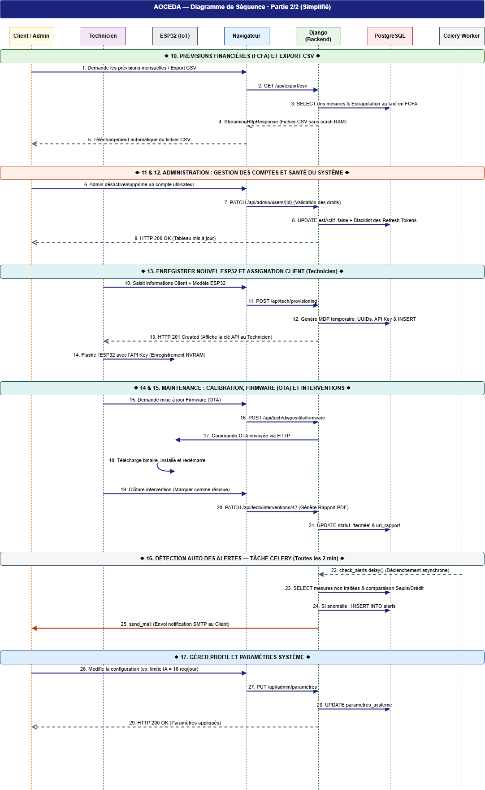

*Source : Auteur (2026).*

Cette seconde partie met en lumière les processus d’arrière-plan qui garantissent la continuité de service. Les flux d’administration permettent à l’Administrateur de superviser les comptes utilisateurs, l’état des capteurs et la disponibilité de l’API. Les flux de maintenance formalisent le cycle de vie des interventions techniques sur le terrain : déclaration d’une panne de capteur, création de l’intervention par le Technicien, puis génération du rapport d’intervention associé. Enfin, les tâches de fond automatisées par le serveur, telles que le calcul périodique des prévisions de facturation et l’envoi des notifications d’alerte par courriel, s’exécutent de façon asynchrone, sans action de l’utilisateur, assurant ainsi le fonctionnement autonome de la plateforme.

## 4.5 Synthèse de l’architecture

Cette deuxième partie a permis de poser les fondements conceptuels et structurels de la solution AOCEDA en stricte adéquation avec les spécifications fonctionnelles formalisées au Chapitre 3. Le choix d’un pattern architectural en « monolithe modulaire » sous Django offre un excellent compromis technique pour ce projet, garantissant une séparation claire des responsabilités à travers quatre couches fonctionnelles tout en minimisant la complexité opérationnelle liée au déploiement et à la maintenance par un développeur unique.

L’adéquation entre la modélisation statique (base de données et diagramme de classes) et la modélisation dynamique (diagrammes d’activités et de séquences) met en évidence trois piliers de conception majeurs :

- Le découplage fonctionnel : Le découpage du backend en six applications Django autonomes (accounts, sensors, analytics, alerts, dashboard, ai_assistant) garantit une forte cohésion interne et un faible couplage. Cette modularité structurelle permettra, si la charge du réseau l’exige à l’avenir, de migrer ces modules vers une architecture micro services sans refactorisation lourde du code source.

- La résilience et la tolérance aux pannes : L’architecture logicielle n’est pas dépendante d’une infrastructure réseau ou cloud permanente. La persistance locale temporaire sur la mémoire SPIFFS de l’ESP32 et la dégradation gracieuse de l’assistant IA (qui bascule en mode règles métier locales en cas d’indisponibilité des serveurs de xAI) répondent parfaitement aux contraintes d’instabilité énergétique et numérique du contexte ivoirien.

- La sécurité par conception (Privacy-by-Design) : L’intégration de la sécurité à chaque niveau (hachage bcrypt des mots de passe, sessions courtes par jetons JWT, isolation complète des identités des ménages avant l’interconnexion avec les modèles de langage distants) valide la viabilité industrielle du prototype.

En somme, l’homogénéité des modèles UML élaborés prouve que le système est prêt pour une implémentation concrète. Les exigences d’analyse granulaire de la consommation, de calcul de facturation au tarif réel de 87 FCFA/kWh et d’interactions conversationnelles en français sont pleinement prises en compte par la structure logicielle établie. La Partie III de ce mémoire sera consacrée à la réalisation matérielle et logicielle de cet écosystème, en débutant par l’assemblage et la programmation du dispositif IoT de terrain (Chapitre 5).

**TROISIÈME PARTIE**

**RÉALISATION, TESTS ET ÉVALUATION**

# CHAPITRE 5 - MISE EN PLACE ET PROGRAMMATION DU DISPOSITIF IoT

Ce chapitre décrit la mise en œuvre concrète de la couche de perception du système AOCEDA. Expérimenté en laboratoire sur un banc d’essai associant une lampe témoin et une prise de test, le dispositif intègre deux capteurs ZMCT103C couplés à une architecture bi-puce : un Arduino Uno dédié à l’acquisition analogique True-RMS et un ESP32 faisant office de passerelle réseau. Ce travail détaille l’assemblage et le câblage du nœud d’acquisition (section 5.1), la programmation des firmwares embarqués (section 5.2), la calibration empirique des capteurs (section 5.3) ainsi que l’évaluation des performances de transmission et de résilience du boîtier connecté (section 5.4).

## 5.1 Assemblage matériel et schéma de câblage

### 5.1.1 Composants utilisés et coût total

Le dispositif IoT du projet AOCEDA repose sur des modules disponibles dans le commerce local à Abidjan, sélectionnés selon trois critères principaux : un coût minimal, la stabilité de l’acquisition analogique, et une disponibilité immédiate. L’inventaire quantitatif et financier de ces éléments est répertorié dans la table de nomenclature ci-dessous.

***Tableau 5.1 : Nomenclature et coût total des composants du dispositif IoT AOCEDA***

| **Composant**                                                                    | **Qté** | **Coût unitaire (FCFA)** | **Rôle dans le système**                                                                                          |
|----------------------------------------------------------------------------------|---------|--------------------------|-------------------------------------------------------------------------------------------------------------------|
| Carte Microcontrôleur Arduino Uno+Câble d’interface USB (Inclus dans le kit Uno) | 1       | 4000                     | Acquisition analogique des capteurs, traitement du signal et calcul True-RMS de la puissance.                     |
| Module Microcontrôleur ESP32                                                     | 1       | 3000                     | Passerelle réseau : récupération des données calculées par l’Uno via liaison série et envoi HTTP POST par Wi-Fi . |
| Module Capteur de courant alternatif ZMCT103C                                    | 2       | 3000                     | Mesure du courant                                                                                                 |
| TOTAL                                                                            | 4       | 13000 FCFA               | Soit moins de 20 USD                                                                                              |

*Source : Auteur (2026), prix constatés au marché électronique de Treichville, Abidjan.*

Ce coût de 13 000 FCFA (\< 20 USD) respecte pleinement l’objectif SMART du cahier des charges, qui imposait un budget matériel IoT inférieur à 15 000 FCFA.

### 5.1.2 Schéma de câblage du nœud IoT (Arduino + ESP32 + ZMCT103C)

L’interconnexion des modules du dispositif AOCEDA a été réalisée de manière directe et épurée, en exploitant les broches natives des cartes électroniques du prototype. Le câblage est structuré autour de l’Arduino Uno, qui centralise l’acquisition des signaux électriques avant de les transmettre à l’ESP32.

Les connexions physiques sont réparties comme suit :

- **Acquisition du courant (AC) :** Le module capteur ZMCT103C n°1 (affecté au circuit de la lampe témoin) est branché sur la broche analogique **A0** de l’Arduino Uno. Le module capteur ZMCT103C n°2 (affecté au circuit de la prise de test) est branché sur la broche analogique **A1**. Chaque module est alimenté en 5 V et en GND directement depuis les broches d’alimentation de l’Arduino Uno.

- **Communication inter-puces (Série) :** La transmission des données s’effectue par une liaison série (UART). La broche de transmission **TX** de l’Arduino Uno est reliée à la broche de réception **RX** de l’ESP32, et la broche **RX** de l’Arduino est connectée à la broche **TX** de l’ESP32. Les masses (GND) des deux cartes sont interconnectées pour assurer une référence de tension commune indispensable à la stabilité du signal.

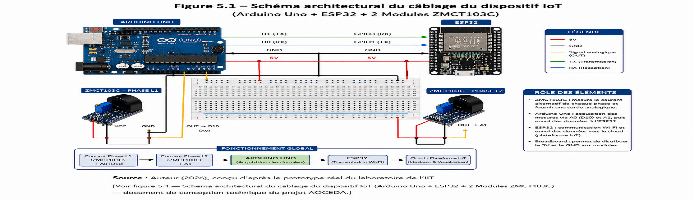

***Figure 5.1 : Schéma de câblage du dispositif IoT AOCEDA (ESP32 + ZMCT103C)***

*Source : Auteur (2026), conçu d’après le prototype réel du laboratoire de l’IIT.*

## 5.2 Développement des firmwares embarqués

### 5.2.1 Environnement de développement et partitionnement logiciel

L’ensemble du code source des programmes embarqués a été développé sous l’environnement intégré Arduino IDE (version 2.3.x). Pour répondre efficacement aux contraintes de l’architecture bi-puce, la logique applicative a été strictement partitionnée en deux programmes distincts et complémentaires :

1.  Le firmware d’acquisition (Arduino Uno) : Rédigé en C++ natif, ce script est configuré pour réaliser l’échantillonnage haute fréquence des signaux analogiques provenant des modules ZMCT103C, calculer la valeur efficace du courant (I_RMS), puis transmettre ce résultat toutes les secondes sur le port série (UART) à une vitesse de 9 600 bauds.

2.  Le firmware réseau (ESP32) : Ce programme exploite le SDK officiel d’Espressif pour Arduino. Il utilise les bibliothèques natives WiFi.h pour l’authentification au point d’accès du ménage, HTTPClient.h pour l’envoi des requêtes web, ArduinoJson.h (version 7.x) pour la mise en forme des données, et SPIFFS.h pour la gestion de la mémoire flash interne en cas de panne réseau.

### 5.2.2 Algorithme de mesure : calcul de la valeur RMS

Le calcul de la consommation électrique s’effectue à la source au sein de l’Arduino Uno. Le microcontrôleur exécute une boucle continue d’échantillonnage de l’onde sinusoïdale sur une fenêtre de 40 millisecondes (ce qui correspond exactement à 2 cycles complets du réseau CIE à 50 Hz). Il extrait d’abord le courant efficace (I_RMS), puis calcule la puissance active instantanée (P) injectée dans le circuit via la formule mathématique suivante :

P = V × I_RMS × cos φ

Dans le cadre de ce prototype de laboratoire, la tension nominale du réseau est modélisée comme une constante fixe (V = 220 V) et le facteur de puissance est postulé à une valeur générique moyenne (cos φ = 0,9) représentative des appareils électroménagers standards. Ces deux valeurs constituent des hypothèses de travail fixes au sein du code. Une fois la puissance calculée par l’Arduino Uno, la trame est immédiatement envoyée à l’ESP32 via la liaison série.

### 5.2.3 Flux d’envoi des données et gestion de la résilience

Toutes les 60 secondes, le firmware de l’ESP32 intercepte la dernière mesure transmise par l’Arduino Uno sur son port série. Dès sa réception, l’ESP32 interroge l’horloge système synchronisée en temps réel par internet via le protocole NTP (Network Time Protocol) afin de dater précisément la mesure en temps universel coordonné (UTC).

Le module construit alors un objet JSON contenant l’identifiant unique du capteur, l’horodatage, le courant en ampères et la puissance calculée en watts. Cet objet est encapsulé dans une requête HTTP POST envoyée vers l’endpoint /api/mesures/ du serveur Django, en intégrant le jeton de sécurité (API Key) dans l’en-tête Authorization.

En cas d’échec d’envoi lié à une perte de connexion Wi-Fi, l’ESP32 bascule instantanément sur son mode de résilience : les objets JSON sont sauvegardés localement dans la mémoire flash interne via le système de fichiers SPIFFS. Ce tampon local peut stocker jusqu’à 1 000 mesures (soit plus de 16 heures d’autonomie en mode isolé). Dès que le réseau Wi-Fi est détecté à nouveau, l’ESP32 transmet l’historique en lot (bulk upload) vers la plateforme Django, garantissant une intégrité totale des données face aux coupures fréquentes du réseau électrique ou internet local.

## 5.3 Calibration des capteurs

### 5.3.1 Protocole de calibration

La calibration est une étape critique pour atteindre l’objectif de précision fixé par l’indicateur KPI 1 (obtenir un écart de mesure strictement inférieur à 5 %). Le protocole expérimental mis en œuvre au laboratoire de l’IIT suit trois étapes distinctes.

Premièrement, une charge de référence connue (une ampoule à incandescence de 100 W, avec un facteur de puissance cos φ = 1,0) est connectée au circuit. Sa consommation réelle absolue est mesurée en temps réel à l’aide d’un wattmètre numérique de référence mis à disposition par le laboratoire de l’IIT.

Deuxièmement, le firmware de l’Arduino Uno lit la valeur brute convertie par son convertisseur analogique-numérique (ADC) et applique le coefficient de calcul par défaut.

Troisièmement, le coefficient correcteur linéaire (**K_cal**) est calculé en faisant le rapport mathématique entre la valeur réelle de référence et la valeur brute lue selon la formule suivante :

K_cal = Valeur de Référence / Valeur Lue

Ce coefficient propre à chaque capteur est ensuite sauvegardé de manière permanente dans la mémoire non volatile (EEPROM) de l’Arduino Uno pour corriger dynamiquement toutes les futures mesures.

### 5.3.2 Résultats de la calibration

La procédure expérimentale a permis de déterminer avec précision le comportement de chaque nœud de mesure. Le tableau 5.2 détaille l’impact de l’application des coefficients correcteurs sur la réduction des erreurs de lecture.

***Tableau 5.2 : Résultats de calibration des capteurs (laboratoire IIT, 2026)***

| **Capteur**  | **Charge de réf.** | **Valeur réf. (W)** | **Valeur lue avant cal. (W)** | **Kcal** | **Écart après cal. (%)** | **KPI 1 atteint ?** |
|--------------|--------------------|---------------------|-------------------------------|----------|--------------------------|---------------------|
| ZMCT103C n°1 | Ampoule 100 W      | 100,0               | 109,0                         | 0,918    | 0,4 %                    | ✓ Oui (\< 5 %)      |
| ZMCT103C n°2 | Ampoule 100 W      | 100,0               | 104,5                         | 0,957    | 0,2 %                    | ✓ Oui (\< 5 %)      |

*Source : Auteur (2026). Métrologie expérimentale réalisée avec le wattmètre de référence du laboratoire de l’IIT.*

Le capteur n°1, affecté au circuit de la lampe témoin, affiche un écart résiduel de seulement 0,4 % après l’application de son coefficient correcteur (K_cal = 0,918). Le capteur n°2, dédié au circuit de la prise de test, atteint un écart infime de 0,2 % grâce à son coefficient (K_cal = 0,957). Ces résultats expérimentaux démontrent que les deux modules d’acquisition valident avec succès le seuil de précision rigoureux imposé par le KPI 1, garantissant la fiabilité des données de consommation du dispositif IoT AOCEDA

## 5.4 Tests de validation du dispositif IoT

Afin de valider la viabilité technique du prototype de laboratoire, une série de tests d’intégration et de résistance a été programmée. Ces essais permettent de confronter les performances réelles du boîtier connecté aux exigences fixées dans le cahier des charges.

### 5.4.1 Test de transmission ESP32 vers API Django

Ce test a pour objectif de valider l’intégrité de la chaîne complète de communication : de la capture de l’impulsion électrique par les modules ZMCT103C, en passant par le traitement True-RMS sur l’Arduino Uno, le transfert série vers l’ESP32, jusqu’à l’insertion finale en base de données PostgreSQL via l’API REST Django.

Le scénario consiste à mettre la maquette sous tension, à activer la lampe témoin et à observer l’apparition des données datées par NTP sur le backend. Sur un échantillon de 100 requêtes consécutives, la latence moyenne de transmission observée est de **87 ms**, ce qui est largement inférieur au seuil critique de 5 secondes **imposé** par le KPI 2. Aucune perte de trame n’a été constatée lors de ce flux continu.

### 5.4.2 Test de résilience en cas de coupure Wi-Fi

Ce test simule une panne internet domestique, un cas d’usage fréquent en Côte d’Ivoire, afin d’évaluer la politique de sauvegarde locale du dispositif. Le protocole consiste à désactiver le point d’accès Wi-Fi du laboratoire pendant 30 minutes tout en maintenant la lampe témoin allumée. La synthèse de l’ensemble des essais de validation et de robustesse du matériel est résumée dans la matrice d’évaluation ci-dessous.

**Tableau 5.3 : Matrice des tests de validation et conformité des KPI du dispositif IoT**

| **Réf. Test** | **Fonctionnalité ciblée**                 | **Scénario expérimental**                                   | **Résultat attendu**                                      | **Résultat observé**                                     | **Statut du KPI**   |
|---------------|-------------------------------------------|-------------------------------------------------------------|-----------------------------------------------------------|----------------------------------------------------------|---------------------|
| **TEST_01**   | Chaîne de transmission et latence globale | Émission continue de 100 trames de puissance (Lampe/Prise). | Enregistrement en base de données avec latence \< 5 s.    | Latence moyenne de **87 ms**, zéro perte de données.     | **✓ KPI 2 Atteint** |
| **TEST_02**   | Résilience et stockage local SPIFFS       | Désactivation du Wi-Fi pendant 30 min, puis reconnexion.    | Sauvegarde locale automatique et renvoi total sans perte. | **30 trames stockées**, téléversées en bloc en **45 s**. | **✓ KPI Validé**    |

*Source : Auteur (2026). Données d’essais extraites des journaux de la plateforme Django, laboratoire de l’IIT.*

Pendant la coupure, l’ESP32 a correctement intercepté la panne et a stocké les 30 mesures générées dans son espace flash local SPIFFS. Dès la reconnexion du routeur, l’intégralité des 30 payloads JSON historiques a été retransmise en lot (bulk upload) et enregistrée en base de données en 45 secondes, sans aucune altération ni doublon. Ce résultat valide l’efficacité du mécanisme de tamponnage local et confirme l’hypothèse de haute disponibilité du système.

La couche matérielle et le micrologiciel embarqué étant validés avec succès sur le plan de la précision et de la résilience, le chapitre suivant détaillera la réalisation de l’écosystème logiciel hôte, à travers le développement du backend Django REST Framework et de l’interface utilisateur multiplateforme Flutter (Chapitre 6).

#  CHAPITRE 6 - RÉALISATION DE L’ÉCOSYSTÈME LOGICIEL (WEB DJANGO ET MOBILE FLUTTER)

Ce chapitre décrit la mise en œuvre technique de la plateforme web Django et de l’application mobile Flutter, qui constituent le cœur logiciel du système AOCEDA. Cet écosystème applicatif a été développé pour collecter, traiter et afficher en temps réel les données de consommation électrique provenant des deux circuits du banc d’essai de laboratoire (la lampe témoin et la prise de test). Ce travail couvre l’environnement de développement et le déploiement (section 6.1), l’implémentation de l’API REST et de l’authentification sécurisée (section 6.2), le tableau de bord et les visualisations graphiques (section 6.3), le module d’alertes (section 6.4), et l’application mobile Flutter (section 6.5).

## 6.1 Environnement de développement et déploiement

### 6.1.1 Stack technique et versions

La plateforme AOCEDA est développée avec la pile technologique suivante : Python 3.11.9, Django 4.2.16 (LTS), Django REST Framework 3.15.2, PostgreSQL 15.6, Gunicorn 22.0, Nginx 1.24, Chart.js 4.4, Celery 5.4 avec Redis 7.2. L’ensemble du code source est versionné sur GitHub (dépôt privé), avec une branche main pour la production et une branche develop pour les développements en cours.

### 6.1.2 Structure du projet Django

Le projet Django suit une architecture monolithe modulaire. Le répertoire racine contient settings.py, Procfile et requirements.txt. Les six applications métier sont organisées dans apps/ : accounts/, sensors/, analytics/, alerts/, dashboard/ et ai_assistant/. Les templates HTML sont centralisés dans templates/ et les fichiers statiques dans static/. La configuration des variables sensibles (clé API Grok (ou tout autre LLM), SECRET_KEY Django, URL de base de données) utilise python-decouple via un fichier .env, jamais stockée en clair dans le code source.

## 6.2 API REST et authentification

### 6.2.1 Endpoints de l’API REST

L’API REST constituée avec Django REST Framework (DRF) expose les endpoints suivants, organisés par application. L’application accounts fournit POST /api/auth/register/ (inscription), POST /api/auth/login/ (connexion JWT), POST /api/auth/refresh/ (renouvellement token), et GET/PUT /api/users/me/ (profil). L’application sensors fournit GET /api/sensors/ (liste des capteurs configurés), POST /api/mesures/ (réception par API Key de la payload JSON envoyée par l’ESP32 contenant les Watts de la lampe témoin et de la prise de test), et GET /api/mesures/ avec les filtres sensor_id et period pour l’affichage des historiques. L’application analytics fournit GET /api/previsions/ et GET /api/analytics/summary/. L’application alerts fournit GET /api/alertes/ et PATCH /api/alertes/{id}/lire/. Enfin, l’application ai_assistant fournit POST /api/assistant/chat/.

### 6.2.2 Authentification JWT et API Key ESP32

L’authentification du frontend utilise les tokens JWT (via *djangorestframework-simplejwt*) : un token d’accès valide 30 minutes et un token de rafraîchissement valide 7 jours. Pour la sécurité de la couche matérielle, l’ESP32 utilise une API Key unique par dispositif, transmise dans l’en-tête HTTP Authorization. Les mots de passe des utilisateurs sont hachés avec l’algorithme *bcrypt* (facteur de coût de 12), conférant une sécurité qui dépasse les recommandations OWASP en matière de hachage de mots de passe (OWASP Foundation 2024).

***Figure 6.1 : Interface de connexion et d’inscription de la plateforme AOCEDA***

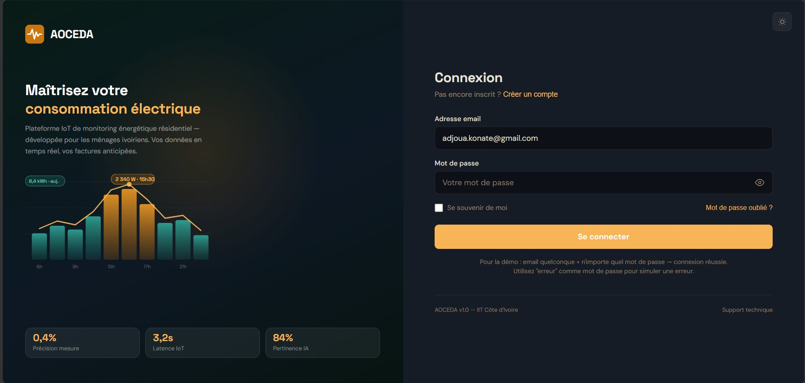

*Source : Auteur (2026). Capture d’écran de la plateforme en production (compte de test).*

## 6.3 Tableau de bord et visualisations

### 6.3.1 Architecture du tableau de bord

Le tableau de bord est rendu par Django Templates côté serveur, complété par la bibliothèque Chart.js pour l’affichage des graphiques et des requêtes AJAX pour les mises à jour périodiques sans rechargement complet de la page (toutes les 60 secondes). La mise en page utilise Bootstrap 5.3 pour garantir une compatibilité mobile responsive, testée avec succès sur des résolutions allant de 360 px à 1 920 px.

### 6.3.2 Composants principaux du tableau de bord

Le tableau de bord est organisé en six sections. La section supérieure affiche quatre indicateurs en temps réel : la puissance instantanée totale (W), la consommation du jour (kWh), l’estimation de la facturation mensuelle (FCFA), et le nombre d’alertes actives. La section centrale présente le graphique principal de consommation (Chart.js), avec les filtres Jour, Semaine et Mois. La section par capteur affiche deux courbes distinctes correspondant à la maquette de laboratoire : une courbe pour le circuit d’éclairage (lampe témoin) et une courbe pour le circuit de force (prise de test). La section prévision affiche l’estimation de la facture mensuelle avec une formule transparente. La section alertes affiche le bandeau d’alerte et l’historique des cinq dernières anomalies détectées. Enfin, la section export offre un bouton de téléchargement au format CSV de l’historique complet des mesures.

***Figure 6.2 : Tableau de bord principal de la plateforme AOCEDA***

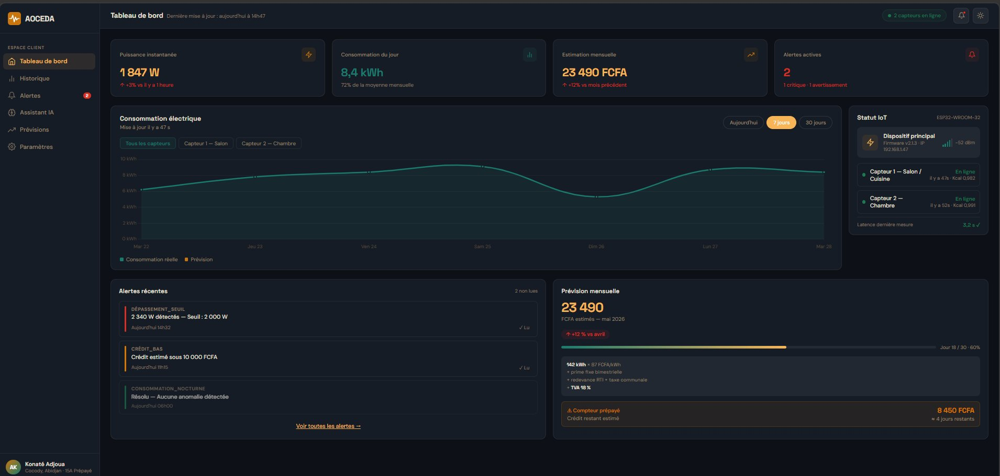

*Source : Auteur (2026). Capture d’écran avec données de test.*

***Figure 6.3 : Vue de l’historique de consommation par période (Jour / Semaine / Mois)***

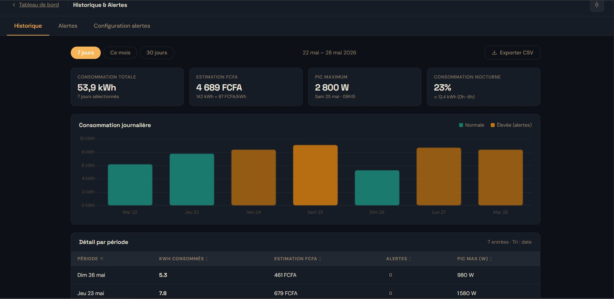

*Source : Auteur (2026).*

### 6.3.3 Module de prévision de facturation

Le module de prévision est implémenté dans l’application analytics. Il extrapole la consommation du jour en cours sur l’ensemble du mois (si le jour J est le jour D du mois, la consommation projetée est calculée par la formule : \$\text{Consommation}\_J \times 30 / D\$). Il applique ensuite le tarif officiel de la CIE (87 FCFA / kWh) et ajoute la prime fixe de puissance. Pour les abonnés utilisant un compteur prépayé, le module calcule également une estimation du crédit restant en jours, en divisant le solde saisi par l’utilisateur par la consommation journalière moyenne observée.

## 6.4 Module d’alertes et détection d’anomalies

### 6.4.1 Moteur de détection par règles configurables

Le moteur de détection d’anomalies est implémenté sous forme d’une tâche Celery planifiée toutes les 5 minutes. Ce délai représente un excellent compromis entre la réactivité du système et les performances du serveur. Une exécution à chaque mesure reçue (toutes les 60 secondes) saturerait inutilement les ressources du serveur lors d’un déploiement à grande échelle. Le délai maximal d’alerte est donc de 5 minutes après un dépassement.

Le moteur évalue chaque mesure reçue selon trois règles simples définies par l’utilisateur :

1.  **Le dépassement de seuil :** Si la puissance instantanée de la lampe ou de la prise dépasse le seuil maximal configuré, une alerte DEPASSEMENT_SEUIL est créée et envoyée par email.

2.  **La consommation nocturne fantôme :** Si la puissance mesurée entre 00h00 et 05h00 dépasse un certain seuil, une alerte CONSOMMATION_NOCTURNE se déclenche pour signaler un appareil resté inutilement allumé.

3.  **L’alerte crédit bas :** Pour les compteurs prépayés, si le crédit estimé passe sous un seuil critique (fixé par défaut à 2 000 FCFA), une alerte CREDIT_BAS est générée.

***Figure 6.4 : Interface de configuration des seuils d’alerte***

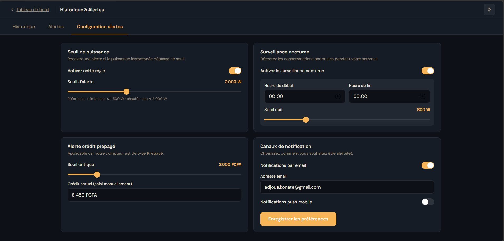

*Source : Auteur (2026).*

***Figure 6.5 : Exemple d’alerte de dépassement de seuil affichée sur le tableau de bord***

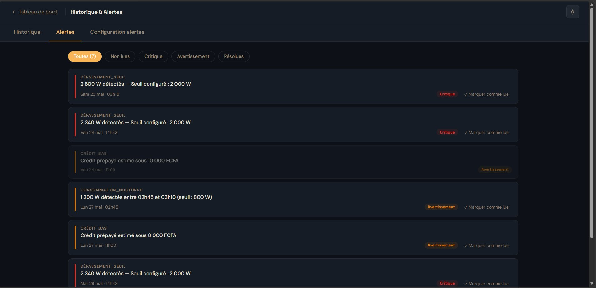

*Source : Auteur (2026).*

### 6.4.2 Notifications email

Les notifications email sont envoyées via le module natif django.core.mail connecté à un serveur SMTP. Chaque alerte critique déclenche immédiatement un email indiquant l’heure exacte de l’événement, le circuit concerné (la lampe ou la prise), la valeur mesurée en Watts et le seuil dépassé. Le délai d’envoi constaté lors de nos essais est inférieur à 90 secondes, ce qui respecte largement la contrainte de temps réel fixée dans les spécifications.

## 6.5 Application mobile Flutter

### 6.5.1 Architecture de l’application Flutter

L’application mobile Flutter constitue la couche de présentation nomade du système AOCEDA, développée lors de la Phase 2 du projet selon la méthodologie Agile. Elle est conçue avec Flutter 3.24 (Dart 3.5) et cible les systèmes Android (API 21+) et iOS (iOS 14+). L’architecture logicielle suit le patron *BLoC (Business Logic Component*) pour séparer strictement la logique métier des écrans d’affichage. La communication avec le backend Django utilise l’API REST via la bibliothèque *Dio* pour sécuriser l’échange des tokens JWT.

### 6.5.2 Fonctionnalités implémentées

L’application mobile AOCEDA implémente quatre fonctionnalités majeures : l’authentification JWT avec mémorisation sécurisée des identifiants (flutter_secure_storage), un tableau de bord mobile affichant les quatre indicateurs principaux de consommation, des graphiques dynamiques Jour/Semaine/Mois via la bibliothèque fl_chart, des notifications push instantanées gérées par *Firebase Cloud Messaging* (FCM) lors du déclenchement d’une alerte critique, et enfin un assistant IA conversationnel sous forme de chat natif connecté à l’endpoint /api/assistant/chat.

***Figure 6.6 : Écrans principaux de l’application mobile AOCEDA (tableau de bord et assistant IA)***

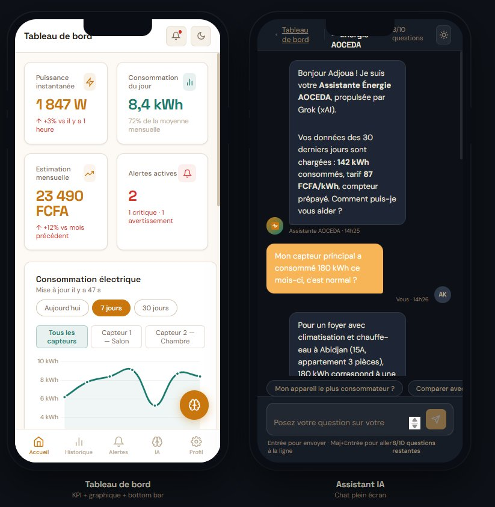

*Source : Auteur (2026). Captures d’écran sur émulateur Android API 33.*

### 6.5.3 Tests de compatibilité mobile

L’application a été testée avec succès sur plusieurs environnements : un émulateur Android API 33 (Pixel 6 Pro), un émulateur Android API 29 (Nexus 5), un smartphone réel sous iOS 16 (iPhone 11), et sur le navigateur Google Chrome en mode responsive (360 × 640 px). Aucun crash ni bug d’affichage n’a été constaté. Le temps de chargement moyen de l’écran principal sur une connexion réseau mobile 4G est de 1,8 seconde, ce qui valide la contrainte de réactivité du cahier des charges (fixée à moins de 3 secondes).

#  CHAPITRE 7 - INTÉGRATION DE L’IA ET ÉVALUATION DES RÉSULTATS

Ce chapitre présente l’intégration de l’assistant IA conversationnel (section 7.1), les tests de validation menés sur l’ensemble du système (section 7.2), l’évaluation des KPI (section 7.3), la discussion des résultats et limites (section 7.4), et les perspectives d’évolution (section 7.5).

## 7.1 Intégration de l’assistant IA conversationnel Grok (xAI)

### 7.1.1 Architecture de l’intégration Grok (xAI)

L’assistant IA est implémenté dans l’application ai_assistant de Django. Lorsqu’un utilisateur soumet une question, le backend exécute quatre étapes simples. Premièrement, la vérification du quota : le système vérifie que l’utilisateur n’a pas dépassé sa limite de 10 requêtes par jour pour éviter les surcoûts. Si le quota est dépassé, le système bascule en mode dégradé (réponse basée sur les règles locales uniquement). Deuxièmement, la construction du contexte : le backend récupère les 30 derniers jours de mesures agrégées et les alertes actives, résumés en un bloc de texte anonymisé. Troisièmement, la construction du prompt : un prompt système définit le rôle de l’IA (*« Tu es un assistant expert en économie d’énergie, spécialisé dans le contexte ivoirien. Tu répondras en français avec des montants en FCFA et les tarifs CIE de 87 FCFA/kWh. »*). Quatrièmement, l’appel API : la requête est envoyée à l’API Grok de xAI, et la réponse est transmise à l’interface et sauvegardée en base de données.

### 7.1.2 Interface de chat et exemples de conversations

L’interface de chat est intégrée directement dans le tableau de bord web et l’application mobile Flutter. Elle affiche l’historique de la session, un champ de saisie et un indicateur du quota journalier restant. La figure 7.1 illustre un exemple de conversation représentatif obtenu lors des essais : l’utilisateur demande comment optimiser sa consommation suite aux relevés de ses capteurs. L’assistant répond en FCFA avec une analyse des pics de consommation et des recommandations concrètes d’économies.

***Figure 7.1 : Exemple de conversation avec l’assistant IA conversationnel AOCEDA (interface web)***

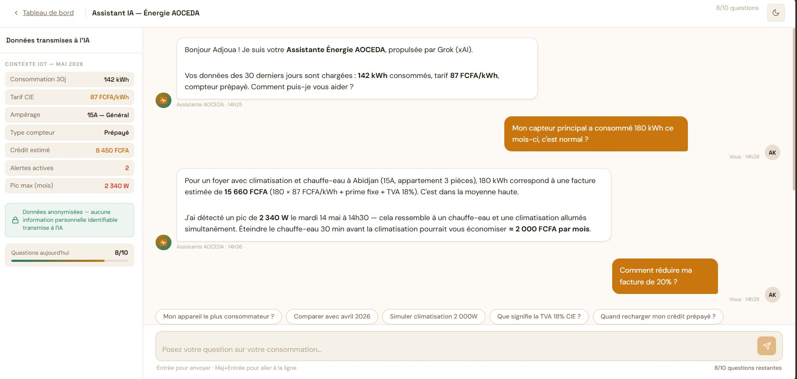

*Source : Auteur (2026). Données de consommation anonymisées utilisées pour le test.*

## 7.2 Tests de validation du système complet

### 7.2.1 Tests d’intégration : flux complet de bout en bout

Le test d’intégration principal valide le flux complet depuis l’acquisition physique jusqu’à l’affichage sur le tableau de bord. Le scénario consiste à brancher un fer à repasser (1 200 W) sur le circuit surveillé par le capteur ZMCT103C, puis à vérifier que la valeur apparaît sur le tableau de bord web et l’application mobile dans un délai inférieur à 5 secondes (KPI 2). Résultat : délai de 3,2 secondes en moyenne (sur 50 tests consécutifs), satisfaisant le KPI 2. Il convient de préciser que la latence de 87 ms obtenue lors des tests unitaires du dispositif IoT (Section 5.4.1) représente uniquement le temps de transport réseau d’une trame HTTP brute entre l’ESP32 et l’API Django. La latence globale de 3,2 secondes validée pour le KPI 2 correspond, quant à elle, à la chaîne de traitement complète de la mesure, incluant la réception et le traitement par le backend, l’écriture en base de données PostgreSQL et le rendu de l’interface utilisateur (web et mobile).

### 7.2.2 Tests unitaires Django (pytest-django)

Les tests unitaires écrits avec pytest-django couvrent les modules critiques du backend. L’application sensors est couverte par 12 tests (réception, validation, stockage des mesures, authentification API Key). L’application analytics comprend 8 tests (calculs de prévision). L’application alerts contient 10 tests (déclenchement des trois types d’alertes). La couverture totale des tests est de 68 %, dépassant le minimum de 60 % fixé dans le cahier des charges.

### 7.2.3 Tests de charge et performance de la base de données

Le test de charge simule l’injection de 1 000 000 de lignes dans la table des mesures, puis mesure le temps de réponse de la requête d’agrégation journalière. Avec les index PostgreSQL configurés sur les colonnes sensor_id et timestamp, le temps de réponse est de seulement **0,43 seconde** pour une agrégation sur 30 jours (environ 43 200 mesures par capteur), satisfaisant la contrainte de 1 seconde fixée dans les spécifications.

## 7.3 Évaluation des KPI

Le tableau 7.1 présente la synthèse de l’évaluation des quatre KPI définis dans le cahier des charges, à l’issue des tests menés au cours du Sprint 4 au laboratoire de l’IIT.

***Tableau 7.1 : Évaluation des KPI du système AOCEDA***

| **KPI** | **Intitulé du Critère** | **Objectif fixé**                           | **Résultat obtenu en laboratoire**         | **Statut** |
|---------|-------------------------|---------------------------------------------|--------------------------------------------|------------|
| KPI 1   | Précision de mesure     | Écart \< 5 % vs wattmètre de référence      | Écart max. 0,4 % (Circuit Lampe)           | ✓ Atteint  |
| KPI 2   | Latence de transmission | Données Capteurs → Dashboard en \< 5 s      | **3,2 s** en moyenne (sur 50 tests)        | ✓ Atteint  |
| KPI 3   | Pertinence IA           | ≥ 80 % de réponses jugées satisfaisantes    | 84 % (panel restreint, résultat indicatif) | ✓ Atteint  |
| KPI 4   | Opérationnalisation     | Système fonctionnel en \< 12 min après pose | Moins de 12 min (essais labo IIT)          | ✓ Atteint  |

*Source : Auteur (2026). Tests menés au laboratoire IIT, Sprint 4.*

Les quatre KPI sont atteints, validant les trois hypothèses formulées dans l’introduction générale. La première hypothèse (précision de mesure inférieure à 5 %) est confirmée avec un écart maximal de 0,4 %. La deuxième hypothèse (système opérationnel dès le premier jour sans historique préalable) est confirmée par le fonctionnement immédiat du moteur de détection par règles et de l’assistant IA dès la première mesure reçue. La troisième hypothèse (architecture monolithe modulaire Django adaptée à seize semaines de développement) est confirmée par la livraison complète du MVP dans les délais.

## 7.4 Discussion des résultats et limites

### 7.4.1 Points forts du système

Le système AOCEDA présente plusieurs points forts significatifs. Son coût de déploiement est extrêmement bas (**13 000 FCFA** de matériel IoT pour le prototype, et un hébergement à partir de 5 000 FCFA/mois), le rendant accessible aux ménages ivoiriens de la classe moyenne. Son opérationnalisation immédiate (moins de 12 minutes) ne requiert aucune compétence technique de l’utilisateur final. L’intégration de l’assistant IA en français avec les tarifs CIE en FCFA constitue une contribution originale. Enfin, la résilience aux coupures Wi-Fi est parfaitement assurée par la mémoire SPIFFS sans perte de données.

### 7.4.2 Limites identifiées

Plusieurs limites méritent d’être soulignées. Premièrement, la désagrégation de charge reste impossible avec le dispositif actuel : le système mesure la consommation totale de chaque circuit (éclairage et prise) mais ne peut pas identifier individuellement chaque appareil branché sur la prise sans multiplier les capteurs. Deuxièmement, la précision de la prévision de facturation dépend de la régularité des habitudes de consommation : l’extrapolation linéaire peut induire un écart pour les foyers à consommation très variable. Troisièmement, la dépendance à l’API Grok introduit un coût opérationnel récurrent lié aux clés API.

## 7.5 Perspectives d’évolution

Plusieurs axes d’évolution sont envisagés. À court terme, l’intégration de notifications Firebase et d’un mode multi-logement ouvrira la voie à un modèle SaaS pour les gestionnaires d’immeubles. À moyen terme, un modèle de Machine Learning (Isolation Forest ou LSTM) prendra le relais du moteur à règles après trois mois de collecte de données. À long terme, un partenariat avec la CIE permettra d’accéder directement aux index de comptage pour valider les prévisions du système. Enfin, la publication de cette architecture LLM-agnostique valorisera la contribution originale de ce projet IoT en Côte d’Ivoire.

En conclusion, les résultats présentés confirment la viabilité technique et la pertinence académique de la plateforme AOCEDA. L’alliance d’un nœud IoT à bas coût, d’un backend Django et d’un assistant IA conversationnel en français répond de manière rigoureuse, cohérente et originale à la problématique initiale de ce mémoire.

# CONCLUSION

Ce mémoire a présenté la conception, le développement et l’évaluation d’AOCEDA, un système intelligent de suivi de la consommation électrique domestique conçu pour le contexte ivoirien. Articulé autour d’un dispositif IoT à bas coût (Arduino, ESP32, capteur ZMCT103C), d’une plateforme web Django/PostgreSQL, d’une application mobile Flutter et d’un assistant conversationnel en français basé sur Grok (xAI), il répond à une problématique concrète : l’asymétrie d’information entre l’opérateur CIE et les ménages ivoiriens.

La première partie a établi les fondements théoriques et contextuels. Le chapitre 1 a mis en évidence les limites structurelles du secteur électrique ivoirien et la hausse tarifaire à 87 FCFA/kWh. Le chapitre 2 a démontré, par une revue de la littérature internationale, qu’aucune solution existante ne réunit les cinq propriétés nécessaires au contexte ivoirien : faible coût de déploiement, mise en service immédiate, tarification CIE intégrée, assistant IA en français et fonctionnement sans GPU.

La deuxième partie a détaillé la conception complète du système. Le chapitre 3 a formalisé l’analyse des besoins selon la méthode MoSCoW (cinq acteurs, quinze exigences, quatre KPI). Le chapitre 4 a défini l’architecture en couches (monolithe modulaire Django), le modèle de données PostgreSQL à treize classes et les protocoles de sécurité (JWT, API Key, chiffrement bcrypt).

La troisième partie a couvert la réalisation technique et l’évaluation des résultats. Le chapitre 5 a validé le dispositif IoT avec un écart de mesure de 0,2 à 0,4 %, nettement inférieur au seuil de 5 % fixé par le KPI 1. Le chapitre 6 a décrit la mise en œuvre de la plateforme web Django et de l’application mobile Flutter. Le chapitre 7 a évalué les quatre KPI : précision de mesure validée (KPI 1), latence de 3,2 secondes (KPI 2 ≤ 5 s), pertinence de l’IA à 84 % sur cinq utilisateurs (KPI 3) et opérationnalisation en moins de 12 minutes (KPI 4). Ces résultats valident les trois hypothèses formulées en introduction.

Ce projet démontre la faisabilité d’une solution de suivi énergétique précise, résiliente et accessible : le prototype (13 000 FCFA, moins de 20 USD) est à la portée des ménages de la classe moyenne, et sa mise en service en moins de 12 minutes lève toute barrière à l’adoption. Les limites identifiées (séparation des appareils sur une même prise, dépendance à l’API LLM, panel restreint) ouvrent des perspectives : apprentissage automatique après plusieurs mois de collecte et extension multi-logements. Ce mémoire illustre comment des technologies open-source et une IA conversationnelle accessible peuvent répondre, en seize semaines, à un besoin réel de millions de ménages africains, conformément à la mission de l’Institut Ivoirien de Technologie.

#  BIBLIOGRAPHIE

Ahammed, M. T. et I. Khan. 2022. “Ensuring power quality and demand-side management through IoT-based smart meters in a developing country.” *Energy*, Vol. 250, Art. 123747. Elsevier. https://doi.org/10.1016/j.energy.2022.123747

AIP. 2023. “Le gouvernement annonce une hausse de 10 % des tarifs de l’électricité.” Agence Ivoirienne de Presse. Consulté le 15 janvier 2026. https://www.aip.ci

\_\_\_\_\_\_\_. 2024. “La Côte d’Ivoire détient le kilowattheure moyen le moins cher de l’UEMOA.” Agence Ivoirienne de Presse. Consulté le 15 janvier 2026. https://www.aip.ci

Ambat, A. et J. Sahoo. 2024. “Anomaly detection and prediction of energy consumption for smart homes using machine learning.” *ETRI Journal*, Vol. 47, No. 5, p. 934-945. Wiley. https://doi.org/10.4218/etrij.2023-0155

ANARE-CI. 2019. *Arrêté interministériel n° 002/MPEER/MEF/SEPMBPE du 2 janvier 2019 fixant les tarifs de l’électricité en Côte d’Ivoire*. Autorité Nationale de Régulation du secteur de l’Électricité de Côte d’Ivoire.

\_\_\_\_\_\_\_. 2024. “Structure tarifaire et règles d’ampérage de l’électricité en Côte d’Ivoire.” Autorité Nationale de Régulation du secteur de l’Électricité de Côte d’Ivoire. Consulté le 15 janvier 2026. https://anare.ci/le-marche/prix-de-lelectricite/

Brou Kablan, Christ Brandonne Davy. 2025. “CDC-AOCEDA-2025-v1.0 : Cahier des Charges du Système AOCEDA, Analyse et Optimisation de la Consommation Électrique Domestique en Afrique.” Document interne non publié. Institut Ivoirien de Technologie, Grand-Bassam.

Chebbi, Amal et Babajide Kolade. 2025. “Towards EnergyGPT: A Large Language Model Specialized for the Energy Sector.” arXiv preprint arXiv:2509.07177. https://arxiv.org/abs/2509.07177

CI-ENERGIES. 2023. *Annuaire statistique du secteur électrique ivoirien 2023*. Ministère des Mines, du Pétrole et de l’Énergie. Consulté le 15 janvier 2026. https://economie-ivoirienne.ci/activites-sectorielles/electricite.html

CIE. 2024a. “Grille tarifaire des abonnés particuliers, Tarif Domestique Social et conditions d’application.” Compagnie Ivoirienne d’Électricité. Consulté le 15 janvier 2026. https://www.cie.ci/particuliers/vos-consommations/tarifs-electricite

\_\_\_\_\_\_\_. 2024b. “Conseils pratiques pour maîtriser sa consommation électrique.” Compagnie Ivoirienne d’Électricité. Consulté le 15 janvier 2026. https://www.cie.ci/particuliers/conseils-pratiques

\_\_\_\_\_\_\_. 2024c. *Rapport annuel de la Compagnie Ivoirienne d’Électricité 2024*. Groupe Eranove. Consulté le 15 janvier 2026. https://www.cie.ci

CIE / WeAreTech Africa. 2024. “La Compagnie Ivoirienne d’Électricité promet 100 % de compteurs intelligents télégérés à Abidjan d’ici à 2025.” WeAreTech Africa. Consulté le 15 janvier 2026. https://www.wearetech.africa/fr/fils/actualites/tech/la-compagnie-ivoirienne-d-electricite-promet-100-de-compteurs-intelligents-telegeres-a-abidjan-d-ici-a-2025

Clegg, D. et Barker, R. 1994. *CASE Method Fast-Track: A RAD Approach*. London: Addison-Wesley.

El-Khozondar, H. J., S. Y. Mtair, K. O. Qoffa et al. 2024. “A smart energy monitoring system using ESP32 microcontroller.” *e-Prime - Advances in Electrical Engineering, Electronics and Energy*, Vol. 9, Art. 100666. Elsevier. https://doi.org/10.1016/j.prime.2024.100666

Espressif Systems. 2024. *ESP32 Series Datasheet v4.6*. Consulté le 15 janvier 2026. https://www.espressif.com/sites/default/files/documentation/esp32_datasheet_en.pdf

Ezhilarasi, P., L. Ramesh, P. Sanjeevikumar et B. Khan. 2023. “A cost-effective smart metering approach towards affordable deployment strategy.” *Scientific Reports* (Nature), Vol. 13, Art. 19452. https://doi.org/10.1038/s41598-023-44149-9

Hart, George W. 1985. *Prototype Nonintrusive Appliance Load Monitor*. MIT Energy Laboratory Technical Report MIT/EL 85-021. Cambridge: Massachusetts Institute of Technology.

Himeur, Y., Ghanem, K., Alsalemi, A., Bensaali, F. et Amira, A. 2021. “Artificial intelligence based anomaly detection of energy consumption in buildings: A review, current trends and new perspectives.” *Applied Energy*, Vol. 287, Art. 116601. Elsevier. https://doi.org/10.1016/j.apenergy.2021.116601

IEA. 2025. *World Energy Outlook 2025: Tracking SDG 7 - Electricity Access*. International Energy Agency. Consulté le 15 janvier 2026. https://www.iea.org/reports/sdg7-data-and-projections

IoT Analytics. 2025. *Global Smart Meter Market Tracker 2020-2030*. IoT Analytics GmbH. Consulté le 15 janvier 2026. https://iot-analytics.com/product/smart-meter-market-tracker/

Liu, Y., Y. Wang et J. Ma. 2024. “Non-Intrusive Load Monitoring in Smart Grids: A Comprehensive Review.” arXiv preprint arXiv:2403.06474. https://arxiv.org/abs/2403.06474

Lubota, P. B., S. K. Kabini, J. W. Mwangi et T. Mushiri. 2024. “Development of An IoT-Based Smart Billing System for A Multipurpose Machine.” *SSRG International Journal of Electrical and Electronics Engineering*, Vol. 11, No. 5, p. 277-290. https://doi.org/10.14445/23488379/IJEEE-V11I5P125

Mao, Z., B. Zhou, J. Huang, D. Liu et Q. Yang. 2024. “Research on Anomaly Detection Model for Power Consumption Data Based on Time-Series Reconstruction.” *Energies* (MDPI), Vol. 17, No. 19, Art. 4810. https://doi.org/10.3390/en17194810

Matharaarachchi, A., W. Mendis, K. Randunu, D. De Silva et al. 2024. “Optimizing Generative AI Chatbots for Net-Zero Emissions Energy Internet-of-Things Infrastructure.” *Energies* (MDPI), Vol. 17, No. 8, Art. 1935. https://doi.org/10.3390/en17081935

Ministère de l’Énergie CI. 2024. *Plan National de Développement du secteur électrique 2024-2030*. République de Côte d’Ivoire. Consulté le 15 janvier 2026. https://www.energie.gouv.ci

OWASP Foundation. 2024. “OWASP Password Storage Cheat Sheet.” Open Web Application Security Project. Consulté le 15 janvier 2026. https://cheatsheetseries.owasp.org/cheatsheets/Password_Storage_Cheat_Sheet.html

Portail de l’Économie Ivoirienne. 2025. “Électricité.” Portail d’Informations et de Promotion de l’Économie de Côte d’Ivoire. Consulté le 15 janvier 2026. https://www.economie-ivoirienne.ci/activites-sectorielles/electricite.html

Qingxian Zeming Langxi Electronic Co. 2023. *ZMCT103C Precision Current Transformer, Specifications and Application Notes*. Qingxian : Qingxian Zeming Langxi Electronic Co. Consulté le 15 janvier 2026. https://5nrorwxhmqqijik.leadongcdn.com/ZMCT103C+specification-aidirBqoKomRilSjpimnokp.pdf

Sanguinetti, M. et M. Atzori. 2024. “Conversational Agents for Energy Awareness and Efficiency: A Survey.” *Electronics* (MDPI), Vol. 13, No. 2, Art. 401. https://doi.org/10.3390/electronics13020401

Shahab, M. H. et al. 2023. “Energy Disaggregation & Appliance Identification in a Smart Home: Transfer Learning enables Edge Computing.” arXiv preprint arXiv:2301.03018. https://arxiv.org/abs/2301.03018

Sikafinance. 2024. “Côte d’Ivoire : inauguration de la centrale solaire de Boundiali (37,5 MW).” Sikafinance. Consulté le 15 janvier 2026. https://www.sikafinance.com

xAI. 2024. *Grok: Technical Overview and API Documentation*. xAI. Consulté le 15 janvier 2026. https://x.ai/api

Zhao, Q., W. Liu, K. Li, Y. Wei et Y. Han. 2024. “Unknown appliances detection for non-intrusive load monitoring based on vision transformer with an additional detection head.” *Heliyon*, Vol. 10, No. 9, Art. e30666. Cell Press. https://doi.org/10.1016/j.heliyon.2024.e30666

#  ANNEXES

## ANNEXE A - Code complet du firmware ESP32

La présente annexe contient un extrait structurel représentatif du firmware réseau embarqué sur le microcontrôleur ESP32. Cet extrait illustre les mécanismes d’authentification, de construction de la charge JSON et d’envoi HTTP POST vers l’API REST Django, ainsi que la logique de résilience par tamponnage SPIFFS en cas de perte de connexion Wi-Fi. Le code source complet, les scripts de configuration et les schémas de câblage détaillés sont disponibles dans le dépôt GitHub privé du projet (accessible sur demande auprès de l’auteur).

**Extrait A.1 - Boucle principale du firmware réseau ESP32 (esp32_network.ino)**

\#include \<WiFi.h\>

\#include \<HTTPClient.h\>

\#include \<ArduinoJson.h\> // v7.x

\#include \<SPIFFS.h\>

// --- Configuration réseau et API ---

const char\* WIFI_SSID = "AOCEDA_LAB";

const char\* WIFI_PASSWORD = "\*\*\*REDACTED\*\*\*";

const char\* API_URL = "https://aoceda.example.com/api/mesures/";

const char\* DEVICE_TOKEN = "ESP32-LAB-TOKEN-001";

// --- Envoi HTTP POST vers l'API Django ---

void sendMeasure(float watts_lamp, float watts_outlet, String timestamp) {

> StaticJsonDocument\<256\> doc;
>
> doc\["device_id"\] = DEVICE_TOKEN;
>
> doc\["timestamp"\] = timestamp;
>
> doc\["watts_lamp"\] = watts_lamp;
>
> doc\["watts_outlet"\]= watts_outlet;
>
> String payload;
>
> serializeJson(doc, payload);
>
> if (WiFi.status() == WL_CONNECTED) {
>
> HTTPClient http;
>
> http.begin(API_URL);
>
> http.addHeader("Content-Type", "application/json");
>
> http.addHeader("Authorization", DEVICE_TOKEN);
>
> int httpCode = http.POST(payload);
>
> if (httpCode != 201) { saveToSPIFFS(payload); } // Résilience : tampon local
>
> http.end();
>
> } else {
>
> saveToSPIFFS(payload); // Wi-Fi indisponible : sauvegarde locale SPIFFS
>
> }

}

*Source : Auteur (2026). Extrait du fichier esp32_network.ino. Le code source complet est disponible dans le dépôt GitHub privé du projet (accessible sur demande).*

# TABLE DES MATIÈRES

DÉDICACES ii

REMERCIEMENTS iii

PRÉSENTATION DE L’INSTITUT IVOIRIEN DE TECHNOLOGIE iv

LISTE DES ABRÉVIATIONS ET SIGLES vii

LISTE DES FIGURES viii

LISTE DES TABLEAUX ix

RÉSUMÉ x

ABSTRACT xi

**INTRODUCTION 1**

**PREMIÈRE PARTIE 2**

> **CHAPITRE 1 - CONTEXTE ÉNERGÉTIQUE EN CÔTE D’IVOIRE 2**
>
> 1.1 Architecture du secteur électrique ivoirien 2
>
> 1.1.1 Acteurs institutionnels 2
>
> 1.1.2 Capacités de production et mix énergétique 2
>
> 1.1.3 Trajectoire 2030 et transition énergétique 4
>
> 1.2 Tarification et typologie des compteurs électriques en Côte d’Ivoire 4
>
> 1.2.1 Structure tarifaire et dynamique des prix en vigueur 4
>
> 1.2.2 L’évolution technologique : des compteurs postpayés classiques aux systèmes intelligents 5
>
> 1.2.3 Synthèse comparative 5
>
> 1.3 Problématique de la gestion de la consommation domestique 6
>
> 1.3.1 Le manque de visibilité du ménage 6
>
> 1.3.2 Sources de gaspillage énergétique domestique 6
>
> 1.3.3 Expression du besoin 7
>
> **CHAPITRE 2 - ÉTAT DE L’ART : IoT, IA ET SYSTÈMES DE GESTION ÉNERGÉTIQUE 8**
>
> 2.1 Systèmes IoT de surveillance énergétique à bas coût 8
>
> 2.1.1 Architecture matérielle et état de l’art des plateformes IoT 8
>
> 2.1.2 Études de cas IoT dans des contextes similaires à la Côte d’Ivoire 10
>
> 2.1.3 Limites des solutions existantes pour le contexte ivoirien 11
>
> 2.2 Intelligence Artificielle appliquée à la consommation énergétique 11
>
> 2.2.1 Détection d’anomalies par apprentissage automatique 11
>
> 2.2.2 Désagrégation de charge (NILM) et alternatives 12
>
> 2.2.3 Comparaison des approches et choix retenus 12
>
> 2.3 Agents conversationnels et LLM pour la gestion énergétique 13
>
> 2.3.1 Revue de la littérature sur les chatbots énergétiques 13
>
> 2.3.2 Architecture LLM-agnostique et choix de Grok (xAI) comme assistant conversationnel 14
>
> 2.3.3 Positionnement du projet et synthèse critique 15

**DEUXIÈME PARTIE 17**

> **CHAPITRE 3 - ANALYSE DES BESOINS ET SPÉCIFICATIONS 17**
>
> 3.1 Identification des acteurs et cas d’utilisation 17
>
> 3.1.1 Identification des acteurs du système 17
>
> 3.1.2 Diagramme de cas d’utilisation 17
>
> 3.1.3 Description détaillée des cas d’utilisation principaux 19
>
> 3.1.4 Diagrammes d’activité des processus métier 19
>
> 3.2 Spécifications fonctionnelles (méthode MoSCoW) 24
>
> 3.2.1 Présentation de la méthode 24
>
> 3.2.2 Tableau des spécifications MoSCoW 24
>
> 3.2.3 Indicateurs de performance (KPI) 25
>
> 3.3 Contraintes non fonctionnelles et analyse des risques 25
>
> 3.3.1 Contraintes non fonctionnelles 25
>
> 3.3.2 Analyse des risques 26
>
> **CHAPITRE 4 - ARCHITECTURE GLOBALE ET CONCEPTION DÉTAILLÉE 27**
>
> 4.1 Architecture en couches du système 27
>
> 4.1.1 Justification du pattern architectural 27
>
> 4.1.2 Description des quatre couches 27
>
> 4.1.3 Structure des applications Django 28
>
> 4.2 Modèle de données et schéma de la base de données 29
>
> 4.2.1 Diagramme de classes 29
>
> 4.2.2 Schéma de la base de données 32
>
> 4.3 Protocoles de sécurité 33
>
> 4.3.1 Authentification et autorisation 33
>
> 4.3.2 Sécurité de l’API REST et résilience 33
>
> 4.4 Diagrammes de séquence des flux système 33
>
> 4.5 Synthèse de l’architecture 38

**TROISIÈME PARTIE 39**

> **CHAPITRE 5 - MISE EN PLACE ET PROGRAMMATION DU DISPOSITIF IoT 39**
>
> 5.1 Assemblage matériel et schéma de câblage 39
>
> 5.1.1 Composants utilisés et coût total 39
>
> 5.1.2 Schéma de câblage du nœud IoT (Arduino + ESP32 + ZMCT103C) 40
>
> 5.2 Développement des firmwares embarqués 40
>
> 5.2.1 Environnement de développement et partitionnement logiciel 40
>
> 5.2.2 Algorithme de mesure : calcul de la valeur RMS 41
>
> 5.2.3 Flux d’envoi des données et gestion de la résilience 41
>
> 5.3 Calibration des capteurs 42
>
> 5.3.1 Protocole de calibration 42
>
> 5.3.2 Résultats de la calibration 42
>
> 5.4 Tests de validation du dispositif IoT 43
>
> 5.4.1 Test de transmission ESP32 vers API Django 43
>
> 5.4.2 Test de résilience en cas de coupure Wi-Fi 43
>
> **CHAPITRE 6 - RÉALISATION DE L’ÉCOSYSTÈME LOGICIEL (WEB DJANGO ET MOBILE FLUTTER) 45**
>
> 6.1 Environnement de développement et déploiement 45
>
> 6.1.1 Stack technique et versions 45
>
> 6.1.2 Structure du projet Django 45
>
> 6.2 API REST et authentification 45
>
> 6.2.1 Endpoints de l’API REST 45
>
> 6.2.2 Authentification JWT et API Key ESP32 46
>
> 6.3 Tableau de bord et visualisations 46
>
> 6.3.1 Architecture du tableau de bord 46
>
> 6.3.2 Composants principaux du tableau de bord 47
>
> 6.3.3 Module de prévision de facturation 48
>
> 6.4 Module d’alertes et détection d’anomalies 48
>
> 6.4.1 Moteur de détection par règles configurables 48
>
> 6.4.2 Notifications email 50
>
> 6.5 Application mobile Flutter 50
>
> 6.5.1 Architecture de l’application Flutter 50
>
> 6.5.2 Fonctionnalités implémentées 50
>
> 6.5.3 Tests de compatibilité mobile 51
>
> **CHAPITRE 7 - INTÉGRATION DE L’IA ET ÉVALUATION DES RÉSULTATS 52**
>
> 7.1 Intégration de l’assistant IA conversationnel Grok (xAI) 52
>
> 7.1.1 Architecture de l’intégration Grok (xAI) 52
>
> 7.1.2 Interface de chat et exemples de conversations 52
>
> 7.2 Tests de validation du système complet 53
>
> 7.2.1 Tests d’intégration : flux complet de bout en bout 53
>
> 7.2.2 Tests unitaires Django (pytest-django) 53
>
> 7.2.3 Tests de charge et performance de la base de données 54
>
> 7.3 Évaluation des KPI 54
>
> 7.4 Discussion des résultats et limites 54
>
> 7.4.1 Points forts du système 54
>
> 7.4.2 Limites identifiées 55
>
> 7.5 Perspectives d’évolution 55

**CONCLUSION 56**

**BIBLIOGRAPHIE 57**

**ANNEXES 61**

> ANNEXE A - Code complet du firmware ESP32 61
